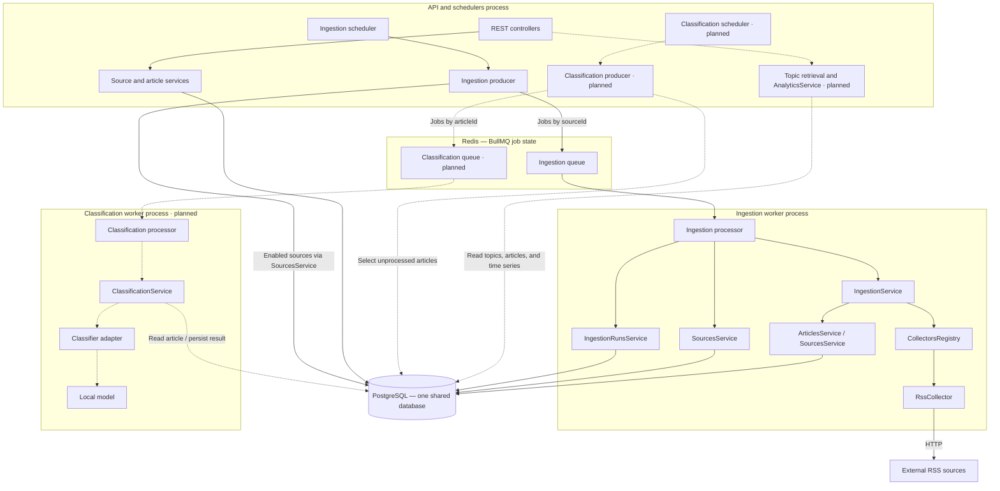

# Media Monitor

[Русский](README.md) | English

A media analytics backend for collecting news from multiple sources, monitoring topics, and investigating relationships between news coverage and economic and financial indicators.

**TypeScript · Node.js · NestJS · PostgreSQL · BullMQ · Redis**

## Purpose

The project aims to quantify the thematic composition of news coverage and how it changes around movements in economic and financial indicators. The primary use case is identifying topics whose share of coverage has increased relative to a baseline period, then examining the underlying publications.

Planned capabilities:

- Build a multi-source corpus while preserving publication timestamps and source provenance.
- Classify articles into multiple topics and retrieve publications by topic, source, and date range.
- Calculate time series of article counts and topic shares, accounting for collection completeness and classification coverage.
- Compare topic trends with a selected indicator over defined time windows, including periods preceding changes in that indicator.

The analytical output consists of topic time series and the associated publications, supporting monitoring and hypothesis testing. The scope includes general news coverage, not just economic reporting. Findings are limited to the observed corpus; temporal relationships alone do not establish causality.

## Current status

**The ingestion pipeline is operational:** REST API, scheduler, a separate worker, partial-failure handling, idempotent article persistence, and an attempt history in PostgreSQL. Background classification, financial data, analytical endpoints, and a UI are planned next. The current version is intended for local use with trusted sources.

## Roadmap

Development proceeds from data collection to topic-based retrieval, then coverage analysis and comparison with indicators.

| Stage | Status | Outcome |
|---|---|---|
| News collection and storage | Implemented | RSS, separate worker, retries, deduplication, attempt history with diagnostics |
| Classification | Planned | Background article processing, persisted topics and classifier version |
| Topic-based retrieval | Planned | Paginated articles by topic, date, and source; access to articles with no assigned topics |
| Coverage analytics | Planned | Article counts and topic shares over time, with classification coverage |
| Indicator comparison | Planned | One economic or financial time series and news preceding a selected change |

### Target architecture

Groups represent process and infrastructure boundaries. Arrows show calls and dependency access, not just data flow. Dashed arrows represent planned connections; the corresponding components are marked “planned”.



All PostgreSQL access goes through repositories, omitted from the diagram. Services appearing in multiple processes are separate instances of shared modules. External economic data ingestion is planned as a separate integration.

Two processes currently run: the API with its scheduler, and the ingestion worker. A third process is planned for classification: it will load the model once and initially process one active job at a time (`concurrency: 1`). The model's computational thread count is configured separately.

The initial classification integration will use a cron-triggered producer. It will select a bounded batch of articles and enqueue **one job with an `articleId` per article**, with duplicate-enqueue protection. The interval and batch size will be tuned after measurement. The same mechanism will process the backlog: if the queue is unavailable after an article is saved, a subsequent pass will find it again. Exhausted job attempts must be distinguishable from a missing job so that cron does not retry permanent failures indefinitely.

Planned storage: `topics` as the topic catalog, `article_classifications` for results by article and classifier version, and `article_classification_topics` for assigned topics and scores. An article can have multiple topics; a completed classification with no topics is distinct from an unprocessed article. The result and its topic associations will be saved in one transaction. Versioning covers the model, taxonomy, text preparation, rules, and thresholds; the API and analytics will select a specific version rather than mixing repeated results.

## Code navigation

| Area | Implementation |
|---|---|
| Attempt orchestration, job results, and errors | [NewsIngestionProcessor](src/news-ingestion/news-ingestion.processor.ts) |
| Collection, persistence, and partial counts | [NewsIngestionService](src/news-ingestion/news-ingestion.service.ts) |
| Extensible adapters and Nest Discovery | [CollectorsRegistry](src/collectors/collectors.registry.ts) |
| External data validation and RSS normalization | [RssCollector](src/rss/rss.collector.ts) |
| Parameterized SQL and uniqueness conflicts | [ArticlesRepository](src/articles/repositories/articles.repository.ts) |
| Attempt history | [IngestionRunsRepository](src/ingestion-runs/ingestion-runs.repository.ts) |
| Database constraints and relationships | [schema.sql](src/database/schemas/schema.sql) |

## Design decisions

- **Modular monolith, two processes.** The API handles HTTP requests, the scheduler enqueues jobs, and the worker performs collection through shared business modules in a separate Nest application context.
- **BullMQ for background work.** Redis holds job state; PostgreSQL stores articles, sources, and attempt history. The two stores serve different purposes.
- **Database-level idempotency.** Jobs may run more than once; a unique constraint protects records independently of application-level checks.
- **Partial results instead of a feed-wide transaction.** Articles already persisted survive a later failure; counters reflect the work completed.
- **Explicit SQL repositories.** Parameterized queries and PostgreSQL constraints define persistence rules.

## Implemented features

- REST API to create, retrieve, enable, and disable sources.
- RSS ingestion jobs scheduled on application startup and every 10 minutes, executed by a separate worker process.
- Storage of article titles, descriptions, URLs, external IDs, and publication dates.
- HTML-to-text conversion for descriptions: entity decoding, paragraph preservation, and trimming; link URLs are not appended to the text.
- Support for both single and multiple RSS entries, field validation, and rejection of invalid items.
- Shared `Collector` / `CollectionResult` / `CollectedItem` contracts; automatic registration of decorated providers through Nest Discovery.
- Duplicate detection by `(external_id, source_id)` using a PostgreSQL unique constraint and `ON CONFLICT DO NOTHING`.
- Explicit article creation outcomes: `created` or `duplicate`.
- Ingestion statistics: `total`, `imported`, `skipped`, `rejected`, and `status` (`SUCCESS`, `PARTIAL`, `FAILED`).
- Partial counts preserved on source failure; other sources continue processing.
- Article retrieval and deletion through the API.
- An `ingestion_runs` table with one record per attempt, start and finish timestamps, final status, counters, and `failure_stage`, `failure_reason`, and `error_message` fields.

## Ingestion flow

```text
NewsIngestionScheduler → Producer → Redis / BullMQ
                                      ↓
                     separate worker → Processor
                                      ↓
                           NewsIngestionService
                             ├── CollectorsRegistry → RssCollector
                             ├── ArticlesService → PostgreSQL
                             └── update lastCollectedAt
```

Each enabled source gets a separate job. The worker reloads the source and returns `SKIPPED` if it has been disabled. Successful or partial processing returns `PROCESSED` with the ingestion result; failures are communicated to BullMQ through exceptions. An insert failure stops ingestion for the current source. Previously saved articles remain in the database and are skipped as duplicates on the next attempt. The Redis queue name `news-import` and job name `import-source` are retained for compatibility; the application module is named `news-ingestion`.

The registry is populated in `onModuleInit`: Discovery finds classes decorated with `@Collects(...)`, validates their collector type, and checks inheritance from the abstract `Collector`. Duplicate type registrations and invalid decorated providers fail initialization. The ingestion service does not depend on the concrete RSS adapter.

Invalid RSS entries are rejected individually; unexpected processing errors stop ingestion for the current source. `lastCollectedAt` is updated on `SUCCESS` and `PARTIAL`, but not on `FAILED`. It records completed processing, not a guarantee of source completeness.

## Reliability and diagnostics

- Up to three job attempts with exponential backoff: retry delays of 2 and 4 seconds. Unknown job names, missing sources, and feeds whose entries are all rejected fail without automatic retries. Other exceptions currently allow bounded retries.
- Up to four active jobs per worker instance. This is neither a requests-per-second limit nor a global limit across processes.
- Source-level deduplication prevents a second job with the same key while the first is unfinished, including retry backoff. A new scheduled ingestion is allowed once the job finishes. This does not guarantee exactly-once execution.
- A 15-second timeout covers the RSS request and response body read, not the entire ingestion operation. Connection errors may occur earlier.
- Redis job retention: up to one day / 1,000 completed jobs and one week / 5,000 failed jobs. Cleanup occurs on subsequent job finalizations, not on a separate timer. PostgreSQL articles are unaffected.
- Logs include the source, job ID, attempt number and duration, counters, and failure stage and reason. Duration excludes queue wait time and backoff.
- If recording the start of an attempt fails, ingestion does not begin. Failure to record completion or a skipped outcome is logged separately and does not replace the original ingestion result. A history record may therefore remain `RUNNING` after work has finished; automatic reconciliation is not implemented.
- PostgreSQL: up to five connections per pool, a 3-second connection timeout, a 30-second idle timeout, and a 10-second `statement_timeout`. The API and worker have separate pools.
- Shutdown hooks are enabled: the worker stops accepting jobs and waits for active jobs before the PostgreSQL pool closes. Abrupt process termination does not guarantee hook execution; shutdown with an active job still needs an integration test.

## Local setup

Requirements: Node.js (version in `.nvmrc`), pnpm (pinned in `package.json`), Docker, and Docker Compose.

### 1. Clone and install dependencies

```bash
git clone https://github.com/naive-algorithm/media-monitor.git
cd media-monitor
nvm use
pnpm install --frozen-lockfile
```

If you do not use nvm, install the specified Node.js version through another method.

### 2. Configure the environment

Copy the example environment file:

```bash
cp .env.example .env
```

These values match the local database in `compose.yaml`:

```dotenv
DB_HOST=localhost
DB_PORT=5432
DB_USER=admin
DB_PASSWORD=password
DB_NAME=nest_pet
REDIS_HOST=127.0.0.1
REDIS_PORT=6379
PORT=3000
```

These are local development settings. `.env` is excluded from Git. The database and container names retain the project's original `nest-pet` naming.

### 3. Start PostgreSQL and Redis, then create the tables

```bash
docker compose up -d postgres redis
docker compose exec postgres pg_isready -U admin -d nest_pet
docker compose exec redis redis-cli PING
```

Wait for `accepting connections`, then run the following **once on a fresh database**:

```bash
docker compose exec -T postgres psql -U admin -d nest_pet -v ON_ERROR_STOP=1 < src/database/schemas/schema.sql
docker compose exec -T postgres psql -U admin -d nest_pet -v ON_ERROR_STOP=1 < src/database/schemas/seed.sql
```

The seed adds BBC News, The Guardian, NYT, NASA, NPR News, and Le Monde. The schema and seed scripts are not idempotent: rerunning them against an initialized database will produce errors for existing tables or sources. Compose runs PostgreSQL and Redis; the application and worker run on the host.

For an existing database without diagnostic columns in `ingestion_runs`, a manual SQL migration preserves existing data:

```bash
docker compose exec -T postgres psql -U admin -d nest_pet -v ON_ERROR_STOP=1 < src/database/migrations/001_add_ingestion_run_failure.sql
```

Apply it only once to the old schema. It is **not required** after initializing a fresh database with the current `schema.sql`: the columns already exist. An automated migration runner and migration tracking table are not implemented.

### 4. Start the application

```bash
pnpm start:dev
```

Start the worker in a separate terminal:

```bash
pnpm worker
```

The API is available at `http://localhost:3000`. The scheduler enqueues jobs at startup and at minutes 00, 10, 20, 30, 40, and 50 of each hour; the separate worker fetches the feeds. Without a worker, jobs wait in Redis. API startup still depends on infrastructure connectivity, but does not wait for feed downloads. The worker command has no watch mode: restart it after code changes. Fetching news requires internet access; results appear in the worker logs.

```bash
curl http://localhost:3000/sources
curl http://localhost:3000/articles
```

If articles do not appear, check the ingestion logs and connectivity to PostgreSQL and the sources.

## REST API

| Method | Path | Purpose |
|---|---|---|
| `GET` | `/sources` | List all sources |
| `GET` | `/sources/enabled` | List enabled sources |
| `GET` | `/sources/:id` | Retrieve a source |
| `POST` | `/sources` | Create an enabled source |
| `POST` | `/sources/:id/enable` | Enable a source; returns `204` |
| `POST` | `/sources/:id/disable` | Disable a source; returns `204` |
| `GET` | `/articles` | List all saved articles |
| `GET` | `/articles/:id` | Retrieve an article |
| `DELETE` | `/articles/:id` | Delete an article; returns `204` |

Request body for `POST /sources`:

```json
{
  "name": "Example News",
  "url": "https://example.com/feed.xml",
  "collectorType": "rss"
}
```

The example URL is a placeholder: replace it with an actual RSS feed URL. Only `collectorType: "rss"` is supported. A new source is picked up on the next scheduled ingestion; there is no dedicated HTTP endpoint for manual execution yet.

## Development and checks

```bash
# Type-check without generating files
pnpm exec tsc --noEmit --incremental false

# Build
pnpm build

# Run the compiled application
pnpm start:prod

# In a separate terminal: run the compiled ingestion worker
node dist/worker.js
```

Scaffold tests have been removed; meaningful automated tests are still to be added. Jest and its configuration remain, but `pnpm test` and `pnpm test:e2e` currently report `No tests found`. The lint script is not ready either: the repository has no ESLint configuration.

## Current limitations

- The RSS parser expects `rss.channel.item`, accepting either a single entry or an array. A title, link, `guid`, and valid publication date are required. Not all RSS variants are supported; Atom is not implemented.
- Descriptions are stripped of HTML but may retain publisher boilerplate such as `Continue reading...`. They are not necessarily full article text; video entries and paywalled publications are not treated separately.
- Updated publications retaining the same external ID within a source are skipped. Different publications about the same event are not merged: ingestion deduplication is not semantic deduplication.
- An `ingestion_runs` record is created after loading the source, so source lookup failures are not recorded there. There is no history API or reconciliation of stale `RUNNING` records. `error_message` stores the top-level message; nested network error causes are available in logs but not stored separately in the database. API pagination is not implemented.
- HTML entities may remain undecoded in titles: description cleanup does not imply full normalization of all fields.
- No RSS download size limit, rate limiting, or centralized environment validation. Job deduplication does not replace idempotent article persistence.
- No authentication or SSRF protection for submitted URLs. The current version is intended for local development, not public API exposure.

## Engineering backlog

- Permanent regression tests for ingestion, queues, and shutdown; CI and working lint configuration.
- Title normalization before classification; validated annotations and per-topic quality evaluation.
- Centralized configuration validation and migration tracking.
- Attempt history API, stale `RUNNING` reconciliation, and richer error diagnostics.
- Atom as a second general-purpose adapter, after the first end-to-end classification and analytics workflow.

Before public deployment: protect management endpoints, validate external URLs against SSRF, add CI, and document the deployment procedure.

## License

[MIT](LICENSE).
