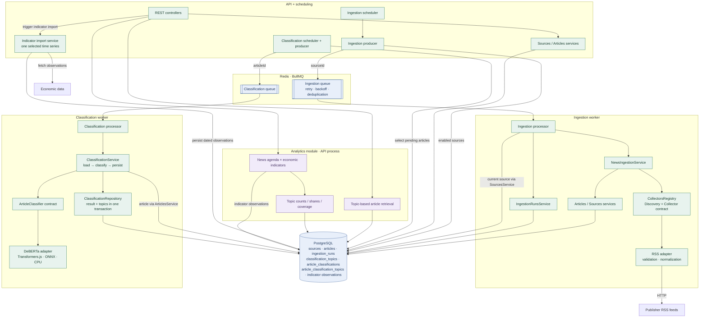

# Media Monitor

[Русский](README.md) | English

A media analytics backend for collecting news, classifying articles by topic, and exploring relationships between the news agenda and economic or financial indicators.

**TypeScript · Node.js · NestJS · PostgreSQL · BullMQ · Redis · Transformers.js · ONNX Runtime**

## Purpose and project status

The target workflow is to select an indicator and time window, compare topic counts and shares against a baseline, and inspect the underlying articles. The service supports monitoring, research, and hypothesis generation; temporal alignment is not treated as proof of causality.

The project is in early, active development, combining service engineering with applied R&D in text classification and media analysis. The MVP brings together ingestion, classification, topic-based retrieval, and an initial analytics workflow. Further releases will expand functionality and improve models.

| Subsystem | Current status |
|---|---|
| Sources and articles | REST API, PostgreSQL, source enable/disable controls |
| News ingestion | RSS adapter, normalization, queue, separate worker, and attempt history |
| Classification | Local model, separate queue and worker, periodic scheduling, transactional topic persistence |
| Topic-based retrieval | Next: filters by topic, source, date, and classifier version |
| Analytics | Planned: news agenda time series and comparison with one economic indicator |

## Architecture

A modular monolith with a shared codebase and three independently launched processes:

| Process | Responsibilities |
|---|---|
| API | HTTP endpoints, ingestion and classification scheduling |
| Ingestion worker | Fetching feeds, validation, normalization, article and attempt persistence |
| Classification worker | Loading the model, processing articles, persisting classification results |

Redis stores jobs and their state. PostgreSQL stores domain data and ingestion history. The API and ingestion worker do not load the model. Each process creates its own Nest application context and database pool.

The diagram shows the **complete target MVP**, including topic-based retrieval and analytics still under development. The table above identifies what is implemented.


```mermaid
flowchart TB
    subgraph APP["API + scheduling"]
        API["REST controllers"] --> READ["Sources / Articles services"]
        CRON["Ingestion scheduler"] --> PROD["Ingestion producer"]
        CP["Classification scheduler + producer"]
        IMPORT["Indicator import service<br/>one selected time series"]
    end
    subgraph REDIS["Redis · BullMQ"]
        IQ[["Ingestion queue<br/>retry · backoff · deduplication"]]
        CQ[["Classification queue"]]
    end
    subgraph INGEST["Ingestion worker"]
        IP["Ingestion processor"] --> IS["NewsIngestionService"]
        IP --> HIST["IngestionRunsService"]
        IS --> REG["CollectorsRegistry<br/>Discovery + Collector contract"]
        REG --> RSS["RSS adapter<br/>validation · normalization"]
        IS --> SAVE["Articles / Sources services"]
    end
    subgraph CLASSIFY["Classification worker"]
        PROC["Classification processor"] --> SERVICE["ClassificationService<br/>load → classify → persist"]
        SERVICE --> CONTRACT["ArticleClassifier contract"]
        CONTRACT --> MODEL["DeBERTa adapter<br/>Transformers.js · ONNX · CPU"]
        SERVICE --> REPO["ClassificationRepository<br/>result + topics in one transaction"]
    end
    subgraph ANALYTICS["Analytics module · API process"]
        QUERY["Topic-based article retrieval"]
        SERIES["Topic counts / shares / coverage"]
        COMPARE["News agenda × economic indicators"]
        COMPARE --> SERIES
    end
    DB[("PostgreSQL<br/>sources · articles · ingestion_runs<br/>classification_topics · article_classifications<br/>article_classification_topics · indicator observations")]
    FEEDS["Publisher RSS feeds"]
    IND["Economic data"]
    PROD -->|sourceId| IQ
    PROD -->|enabled sources| DB
    READ --> DB
    IQ --> IP
    RSS -->|HTTP| FEEDS
    SAVE --> DB
    HIST --> DB
    IP -->|current source via SourcesService| DB
    CP -->|articleId| CQ
    CP -->|select pending articles| DB
    CQ --> PROC
    SERVICE -->|article via ArticlesService| DB
    REPO --> DB
    API --> QUERY
    API --> COMPARE
    API -->|trigger indicator import| IMPORT
    QUERY --> DB
    SERIES --> DB
    IMPORT -->|fetch observations| IND
    IMPORT -->|persist dated observations| DB
    COMPARE -->|indicator observations| DB
    classDef application fill:#e8f3ee,stroke:#287653,color:#163b2b
    classDef analysis fill:#f1ebfa,stroke:#7857a1,color:#493565
    classDef storage fill:#e8effa,stroke:#4569a1,color:#20395e
    class API,READ,CRON,PROD,CP,IP,IS,HIST,REG,RSS,SAVE,PROC,SERVICE,CONTRACT,MODEL,REPO,IMPORT application
    class QUERY,SERIES,COMPARE analysis
    class DB,IQ,CQ storage
```

## 1. Sources and news ingestion

### Sources and collectors

A source has a name, URL, collector type, enabled flag, and last completed collection timestamp. The API manages sources and their participation in ingestion.

The `Collector` contract separates source formats from the ingestion workflow. `CollectorsRegistry` discovers marked implementations through Nest Discovery and selects a collector by source type. RSS is implemented; additional formats can use adapters with the same output contract.

The RSS adapter parses `rss.channel.item`, accepts a single entry or an array, validates fields, and converts title and description HTML to text. It requires a meaningful title, URL, external ID, and valid publication date. The external ID remains the publisher's identifier, not a semantic fingerprint.

Input comes from the feed: descriptions may be excerpts rather than full articles. Publisher boilerplate and format differences belong to ongoing normalization work; fetching paywalled article pages is not part of the pipeline.

### Execution and persistence

At API startup and every 10 minutes, the scheduler enqueues one job per enabled source. The processor reloads the source before execution, checks its current state, and invokes `NewsIngestionService`.

Articles are persisted independently: a failure midway through a feed does not roll back earlier articles. `UNIQUE (external_id, source_id)` and `ON CONFLICT DO NOTHING` protect persistence against repeated delivery. Publications retaining the same ID are skipped; different sources reporting the same event remain separate articles.

The outcome includes status and counts of fetched, imported, skipped, and rejected entries. `lastCollectedAt` records completed source processing, not guaranteed completeness of a publisher's archive.

### Queue and diagnostics

| Setting | Value |
|---|---|
| Concurrency | Up to 4 jobs per worker instance |
| Attempts | Up to 3; exponential backoff of 2 and 4 seconds |
| HTTP timeout | 15 seconds for request and response body |
| Job deduplication | By source while the previous job remains unfinished |
| Redis retention | Completed: up to one day / 1,000; failed: up to one week / 5,000 |
| History | One attempt record in PostgreSQL `ingestion_runs` |

Unknown operations, missing sources, and feeds with all entries rejected fail without automatic retry. Other technical exceptions allow bounded retries. Redis job cleanup runs on subsequent finalizations and does not remove articles.

Logs include source, job ID, attempt, duration, counters, and failure details. Failure to record an attempt's start prevents ingestion; failure to record its completion is logged separately without replacing the ingestion outcome. An interrupted run can remain `RUNNING`; reconciliation is part of the history roadmap.

Code: [registry](src/collectors/collectors.registry.ts), [RSS adapter](src/collectors/adapters/rss/rss.collector.ts), [processor](src/news-ingestion/news-ingestion.processor.ts).

## 2. Classification

### Model and input

The `ArticleClassifier` contract separates the workflow from the model implementation. `DebertaClassifierAdapter` currently performs zero-shot classification of English texts using Transformers.js and ONNX Runtime, without an external LLM API.

| Setting | Current configuration |
|---|---|
| Model | `MoritzLaurer/deberta-v3-base-zeroshot-v2.0`, pinned revision |
| Execution | CPU, FP32, one intra-op and one inter-op computation thread |
| Taxonomy | 40 topics from a selected and adapted IPTC Media Topics subset |
| Input | Title and up to 1,200 description characters |
| Decision | Multiple topics with score ≥ 0.8, or `UNCLASSIFIED` |
| Version | `0.1.0` |

The model scores text against category descriptions. Scores select assignments but are not calibrated probabilities of correctness. `UNCLASSIFIED` means successful processing without accepted topics, not a technical error.

The model loads once during worker initialization and is reused. `CLASSIFIER_CACHE_DIR` defaults to `.cache/models/deberta`. Weights are distributed separately; automatic network downloads are disabled during normal startup.

### Scheduling and execution

The API schedules at startup and every 10 minutes. The producer selects up to 350 articles without a result for the **target version**, ordered by ID. This is a query limit, not a requirement to finish the batch within 10 minutes.

Jobs contain `articleId` and `classifierVersion`. A stable `article-ID-v-VERSION` job ID and deduplication key prevent repeated submission of the same work. Another scheduler pass does not add a duplicate batch. A local guard prevents overlapping passes within one API process.

The worker processes one article at a time: database read → inference → transactional persistence. Consumption starts after model initialization. Graceful shutdown stops new work and drains the active job before releasing the model and database.

The processor checks operation name and version; missing articles are not retried. Other technical errors allow up to three attempts with backoff. Outcome logs include article, version, job, attempt, duration, and status. Worker-level `error` events are logged separately from article-processing failures.

### Data and repeated execution

| Table | Purpose |
|---|---|
| `classification_topics` | Topic codes and names |
| `article_classifications` | Result by article/version, status, and timestamp |
| `article_classification_topics` | Assigned topics and scores for a result |

Inference runs **outside the SQL transaction**. The repository upserts the result, removes previous assignments, and saves the new set in one transaction. Failed writes roll back; if rollback itself fails, both errors are preserved and the connection is discarded.

Terminally failed jobs remain in Redis for diagnosis and explicit retry admission. While the job ID exists, cron cannot create a fresh job with a new attempt counter. Removing the job or clearing Redis removes that protection; successful domain results remain independently stored in PostgreSQL.

The current query targets a bounded corpus: waiting and failed jobs may occupy the first 350 candidate positions. For larger archives, the next step is state-aware candidate selection, backlog control, and PostgreSQL attempt history.

### R&D and quality evaluation

Experiments explored zero-shot DeBERTa, embedding similarity between articles and topic descriptions, multiple category aspects, taxonomy sizes, and thresholds. The application adapter currently uses the model without experimental rules.

The next research iteration combines reviewed annotations, an independent evaluation set, refined category descriptions, and per-topic thresholds. Comparisons include precision / recall / F1, per-topic quality, coverage, latency, and memory. Historical small-sample results are not presented as the current adapter's accuracy.

Classification remains experimental: results are available for inspection and review, while assignment quality develops separately from the technical integration.

Code: [processor](src/classification/queue/classification.processor.ts), [service](src/classification/classification.service.ts), [adapter](src/classification/adapters/deberta/deberta-classifier.adapter.ts), [repository](src/classification/classification.repository.ts).

## 3. Topic-based retrieval and analytics

**Next MVP stage.** Classification results are already persisted; topic endpoints and analytics aggregates are still under development.

Planned workflow:

1. Article retrieval by topic, source, date, and classifier version, with pagination and access to `UNCLASSIFIED`.
2. Time series of publication counts and topic shares, with an explicit corpus and denominator.
3. Baseline comparisons, classification coverage, and source availability.
4. Import of one economic or financial series and comparison with news agenda dynamics.
5. Navigation from a chart point to the publications behind the aggregate.

Classifier versions remain separate so that a model change is not mistaken for a shift in coverage. Metrics describe observed sources, not all world news. The goal is research and hypothesis testing, not automated trading advice.

## 4. Infrastructure and code organization

Code is grouped by feature: `sources`, `articles`, `collectors`, `news-ingestion`, and `classification`. Adapters, queues, and scheduling have dedicated subdirectories. Processors and schedulers initiate workflows, services coordinate them, and repositories execute parameterized SQL.

`database` owns pool configuration and SQL schemas; `queue-infrastructure` owns shared BullMQ/Redis configuration. `AppModule`, `IngestionWorkerModule`, and `ClassificationWorkerModule` assemble each process. Cross-module calls use exported services.

PostgreSQL defaults: up to 5 connections per process pool, a 3-second connection timeout, 30-second idle timeout, and 10-second statement timeout. Redis uses AOF and `noeviction` in Compose. Model weights and private configuration are excluded from the repository.

Files use kebab-case with role suffixes (`.service.ts`, `.repository.ts`, `.adapter.ts`). Related types are grouped; subdirectories reflect responsibilities rather than every individual type.

### Deployment and operations

The current setup targets local use with trusted sources. Public management API exposure requires authentication, SSRF protection for URL fetching, and resource limits. General article pagination, centralized environment validation, migration tracking, and CI are engineering backlog items. Graceful shutdown hooks do not replace recovery from abrupt process termination.

## Local setup

Requirements: Node.js (version in `.nvmrc`), pnpm (pinned in `package.json`), Docker, and Docker Compose.

### 1. Clone and install dependencies

```bash
git clone https://github.com/naive-algorithm/media-monitor.git
cd media-monitor
nvm use
pnpm install --frozen-lockfile
```

If you do not use nvm, install the specified Node.js version through another method.

### 2. Configure the environment

Copy the example environment file:

```bash
cp .env.example .env
```

These values match the local database in `compose.yaml`:

```dotenv
DB_HOST=localhost
DB_PORT=5432
DB_USER=admin
DB_PASSWORD=password
DB_NAME=nest_pet
REDIS_HOST=127.0.0.1
REDIS_PORT=6379
PORT=3000
```

These are local development settings. `.env` is excluded from Git. The database and container names retain the project's original `nest-pet` naming.

### 3. Start PostgreSQL and Redis, then create the tables

```bash
docker compose up -d postgres redis
docker compose exec postgres pg_isready -U admin -d nest_pet
docker compose exec redis redis-cli PING
```

Wait for `accepting connections`, then run the following **once on a fresh database**:

```bash
docker compose exec -T postgres psql -U admin -d nest_pet -v ON_ERROR_STOP=1 < src/database/schemas/schema.sql
docker compose exec -T postgres psql -U admin -d nest_pet -v ON_ERROR_STOP=1 < src/database/schemas/seed.sql
docker compose exec -T postgres psql -U admin -d nest_pet -v ON_ERROR_STOP=1 < src/database/schemas/seed-topics.sql
```

`seed-topics.sql` adds 40 classification topics, skipping existing codes. The source seed adds BBC News, The Guardian, NYT, NASA, NPR News, and Le Monde. The schema and seed scripts are not idempotent: rerunning them against an initialized database will produce errors for existing tables or sources. Compose runs PostgreSQL and Redis; the application and worker run on the host.

For an existing database without diagnostic columns in `ingestion_runs`, a manual SQL migration preserves existing data:

```bash
docker compose exec -T postgres psql -U admin -d nest_pet -v ON_ERROR_STOP=1 < src/database/migrations/001_add_ingestion_run_failure.sql
```

Apply it only once to the old schema. It is **not required** after initializing a fresh database with the current `schema.sql`: the columns already exist. An automated migration runner and migration tracking table are not implemented.

### 4. Start the application

```bash
pnpm start:dev
```

Start the worker in a separate terminal:

```bash
pnpm worker:ingestion
```

For classification, start another process after provisioning the local model weights:

```bash
pnpm worker:classification
```

The API enqueues classification jobs at startup and every 10 minutes; without this worker they wait in Redis. Results are stored in the classification tables; topic-based REST endpoints are not implemented yet. Restart the worker after code changes.

The API is available at `http://localhost:3000`. All three processes start separately; jobs wait in Redis without the corresponding worker. API startup awaits initial enqueueing, not feed downloads or inference. Worker commands do not use watch mode.

```bash
curl http://localhost:3000/sources
curl http://localhost:3000/articles
```

If articles do not appear, check the ingestion logs and connectivity to PostgreSQL and the sources.

## REST API

| Method | Path | Purpose |
|---|---|---|
| `GET` | `/sources` | List all sources |
| `GET` | `/sources/enabled` | List enabled sources |
| `GET` | `/sources/:id` | Retrieve a source |
| `POST` | `/sources` | Create an enabled source |
| `POST` | `/sources/:id/enable` | Enable a source; returns `204` |
| `POST` | `/sources/:id/disable` | Disable a source; returns `204` |
| `GET` | `/articles` | List all saved articles |
| `GET` | `/articles/:id` | Retrieve an article |
| `DELETE` | `/articles/:id` | Delete an article; returns `204` |

Request body for `POST /sources`:

```json
{
  "name": "Example News",
  "url": "https://example.com/feed.xml",
  "collectorType": "rss"
}
```

The example URL is a placeholder: replace it with an actual RSS feed URL. Only `collectorType: "rss"` is supported. A new source is picked up on the next scheduled ingestion; there is no dedicated HTTP endpoint for manual execution yet.

## Checks and development

```bash
pnpm exec tsc --noEmit --incremental false
pnpm build
pnpm test --runInBand
```

57 unit tests cover RSS normalization, ingestion, classification transaction sequencing, service errors, adapter behavior, the producer and processor, and scheduler overlap prevention. External dependencies are replaced: model weights, network access, Redis, and PostgreSQL are not required for unit tests.

An isolated BullMQ smoke check with real Redis also exercised manual worker startup, successful execution, retry exhaustion, and retention of a failed job when its ID is submitted again. Automated integration scenarios and ML quality evaluation are separate testing tracks.

Run compiled processes in separate terminals:

```bash
pnpm start:prod
node dist/ingestion-worker.js
node dist/classification-worker.js
```

## Next milestones

1. Complete classification attempt history and retry admission.
2. Add topic-based retrieval with filters and pagination.
3. Build time series of counts, topic shares, and coverage.
4. Integrate one economic indicator and exploratory comparison.
5. Improve classification using reviewed annotations and expand sources and formats.

After the MVP: broader analytics workflows, reproducible ML experiments, and operational hardening.

## License

Code: [MIT](LICENSE). The taxonomy contains adapted [IPTC Media Topics](https://cv.iptc.org/newscodes/mediatopic/) data under CC BY 4.0; attribution is retained in the JSON. Model weights are distributed separately under their repository's terms.
