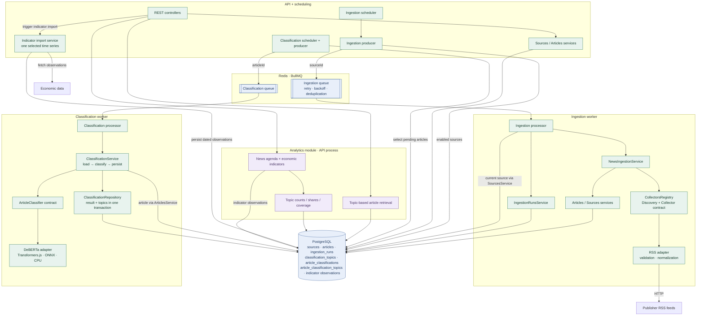

# Media Monitor

[Русский](README.md) | English

A media analytics backend for collecting news from multiple sources, monitoring topics, and investigating relationships between news coverage and economic and financial indicators.

**TypeScript · Node.js · NestJS · PostgreSQL · BullMQ · Redis**

## Purpose

Media Monitor is being developed to investigate changes in news coverage around movements in economic and financial indicators. The target workflow is to select an indicator and time window, identify topics whose share of coverage increased relative to a baseline, and examine the underlying publications.

The system collects a news corpus with source provenance and publication timestamps. The next stages are topic-based retrieval, time series of article counts and topic shares, and comparison with a selected indicator. The scope includes general news coverage, not only economic reporting; findings are limited to the observed corpus and do not establish causality.

The project is in early, active development, combining analytics service engineering with applied R&D in ML classification, taxonomy design, and news analysis. The MVP is the first complete milestone, not the final scope. Further development will expand analytical workflows, improve classification quality, and strengthen operational reliability.

## Current status

| Component | Available now |
|---|---|
| News ingestion | Autonomous RSS ingestion: scheduler, BullMQ, separate worker, normalization, and deduplication |
| API and diagnostics | Source management, article retrieval, attempt history in PostgreSQL, and contextual error logs |
| Classification | Minimal end-to-end path: article from DB → local model → result and topics in one transaction; exercised manually |
| Background classification | Queue and separate worker are not connected yet |
| Topic retrieval and analytics | Planned |

Normal startup runs the API and ingestion worker without loading the model. The current version is intended for local use with trusted sources, not public access to management endpoints.

## Target MVP architecture

A modular monolith with separate API and background processes, a shared codebase, and PostgreSQL. Redis holds BullMQ job state; PostgreSQL stores articles, sources, attempt history, and classification results.

The diagram shows the **complete target MVP**, not current implementation status: from news collection and classification to topic-based retrieval and comparison with one economic or financial indicator. Implementation status is listed above. Groups represent processes; colors distinguish component roles. Arrows represent calls and data access; all PostgreSQL access goes through repositories, with some intermediate layers omitted.


```mermaid
flowchart TB
    subgraph APP["API + scheduling"]
        API["REST controllers"] --> READ["Sources / Articles services"]
        CRON["Ingestion scheduler"] --> PROD["Ingestion producer"]
        CP["Classification scheduler + producer"]
        IMPORT["Indicator import service<br/>one selected time series"]
    end
    subgraph REDIS["Redis · BullMQ"]
        IQ[["Ingestion queue<br/>retry · backoff · deduplication"]]
        CQ[["Classification queue"]]
    end
    subgraph INGEST["Ingestion worker"]
        IP["Ingestion processor"] --> IS["NewsIngestionService"]
        IP --> HIST["IngestionRunsService"]
        IS --> REG["CollectorsRegistry<br/>Discovery + Collector contract"]
        REG --> RSS["RSS adapter<br/>validation · normalization"]
        IS --> SAVE["Articles / Sources services"]
    end
    subgraph CLASSIFY["Classification worker"]
        PROC["Classification processor"] --> SERVICE["ClassificationService<br/>load → classify → persist"]
        SERVICE --> CONTRACT["ArticleClassifier contract"]
        CONTRACT --> MODEL["DeBERTa adapter<br/>Transformers.js · ONNX · CPU"]
        SERVICE --> REPO["ClassificationRepository<br/>result + topics in one transaction"]
    end
    subgraph ANALYTICS["Analytics module · API process"]
        QUERY["Topic-based article retrieval"]
        SERIES["Topic counts / shares / coverage"]
        COMPARE["News agenda × economic indicators"]
        COMPARE --> SERIES
    end
    DB[("PostgreSQL<br/>sources · articles · ingestion_runs<br/>classification_topics · article_classifications<br/>article_classification_topics · indicator observations")]
    FEEDS["Publisher RSS feeds"]
    IND["Economic data"]
    PROD -->|sourceId| IQ
    PROD -->|enabled sources| DB
    READ --> DB
    IQ --> IP
    RSS -->|HTTP| FEEDS
    SAVE --> DB
    HIST --> DB
    IP -->|current source via SourcesService| DB
    CP -->|articleId| CQ
    CP -->|select pending articles| DB
    CQ --> PROC
    SERVICE -->|article via ArticlesService| DB
    REPO --> DB
    API --> QUERY
    API --> COMPARE
    API -->|trigger indicator import| IMPORT
    QUERY --> DB
    SERIES --> DB
    IMPORT -->|fetch observations| IND
    IMPORT -->|persist dated observations| DB
    COMPARE -->|indicator observations| DB
    classDef application fill:#e8f3ee,stroke:#287653,color:#163b2b
    classDef analysis fill:#f1ebfa,stroke:#7857a1,color:#493565
    classDef storage fill:#e8effa,stroke:#4569a1,color:#20395e
    class API,READ,CRON,PROD,CP,IP,IS,HIST,REG,RSS,SAVE,PROC,SERVICE,CONTRACT,MODEL,REPO,IMPORT application
    class QUERY,SERIES,COMPARE analysis
    class DB,IQ,CQ storage
```

### Implemented ingestion flow

The scheduler enqueues one job per enabled source. The processor reloads its state, invokes the ingestion service, and records the attempt outcome. `CollectorsRegistry` discovers implementations of the `Collector` contract through Nest Discovery; the RSS adapter validates external data and converts HTML to text.

Articles are persisted independently: a failure partway through a feed does not roll back completed work. Uniqueness on `(external_id, source_id)` and `ON CONFLICT DO NOTHING` prevent duplicates during repeated execution. Exceptions communicate failures to BullMQ; partial results retain processing counts. `lastCollectedAt` records completed processing, not guaranteed feed completeness.

### Classification

`ClassificationService` loads an article through `ArticlesService`, invokes the `ArticleClassifier` contract, and passes the result to its repository. Inference runs **before** opening the transaction. Errors retain the article ID, execution stage, and original cause.

- `classification_topics`: topic catalog.
- `article_classifications`: result by article and classifier version.
- `article_classification_topics`: assigned topics and scores.

The result and assignments are saved atomically. `UNCLASSIFIED` is successful processing without accepted topics, not a technical failure. Repeating the same article/version pair currently violates the unique constraint; idempotent retry handling remains to be added.

Background integration will use a separate worker with `concurrency: 1` and a periodic producer selecting a bounded batch of pending articles, with one job per `articleId`. This supports both new publications and the existing backlog. Job concurrency and model computation threads are configured independently.

### Ingestion settings and diagnostics

<details>
<summary>Retries, limits, attempt history, and shutdown</summary>

- Up to three job attempts with exponential backoff: retry delays of 2 and 4 seconds. Unknown job names, missing sources, and feeds whose entries are all rejected fail without automatic retries. Other exceptions currently allow bounded retries.
- Up to four active jobs per worker instance. This is neither a requests-per-second limit nor a global limit across processes.
- Source-level deduplication prevents a second job with the same key while the first is unfinished, including retry backoff. A new scheduled ingestion is allowed once the job finishes. This does not guarantee exactly-once execution.
- A 15-second timeout covers the RSS request and response body read, not the entire ingestion operation. Connection errors may occur earlier.
- Redis job retention: up to one day / 1,000 completed jobs and one week / 5,000 failed jobs. Cleanup occurs on subsequent job finalizations, not on a separate timer. PostgreSQL articles are unaffected.
- Logs include the source, job ID, attempt number and duration, counters, and failure stage and reason. Duration excludes queue wait time and backoff.
- If recording the start of an attempt fails, ingestion does not begin. Failure to record completion or a skipped outcome is logged separately and does not replace the original ingestion result. A history record may therefore remain `RUNNING` after work has finished; automatic reconciliation is not implemented.
- PostgreSQL: up to five connections per pool, a 3-second connection timeout, a 30-second idle timeout, and a 10-second `statement_timeout`. The API and worker have separate pools.
- Shutdown hooks are enabled for worker shutdown and PostgreSQL pool cleanup. Abrupt process termination does not guarantee hook execution; shutdown with an active job still needs an integration test.

</details>

## Classification model and R&D

[DebertaClassifierAdapter](src/classification/adapters/deberta/deberta-classifier.adapter.ts) implements the `ArticleClassifier` contract and performs zero-shot classification of English headlines and RSS excerpts using Transformers.js and ONNX Runtime. It uses a pinned DeBERTa revision with FP32 CPU inference; no external LLM API is required.

- 40 categories from a selected and adapted subset of IPTC Media Topics; an article may receive multiple topics.
- Input is a normalized title and up to 1,200 description characters. Version `0.1.0` accepts scores of at least `0.8`, without supplementary keyword rules.
- Output is topic assignments with scores and the classifier version, or `UNCLASSIFIED`. No accepted topics is not a technical failure; model scores are not calibrated probabilities.
- The model is loaded during adapter initialization and reused. Weights are not included in the repository; `CLASSIFIER_CACHE_DIR` defaults to `.cache/models/deberta`. Network downloads are disabled during normal initialization.

### Experiments conducted

Experiments compared zero-shot DeBERTa variants with embedding similarity between articles and topic descriptions, including multiple aspects per category. Taxonomy size, label wording, thresholds, and supplementary rules were evaluated. DeBERTa-base was selected for the current integration; experimental rules are not included in the application adapter.

### Improvement directions

- Refine topic boundaries and expand the taxonomy based on systematic missed topics and false assignments.
- Establish reviewed annotations and separate tuning and held-out sets, keeping closely related reports about the same event from crossing the split.
- Evaluate precision / recall / F1 for article–topic assignments, per-topic performance, and the share of articles without labels alongside memory use and processing time.
- Compare per-topic thresholds, aspect descriptions, hybrid approaches, and alternative models within comparable compute budgets. Accumulated corrected labels may later support training or fine-tuning.

Historical experiments used small samples with preliminary annotations, including AI-generated labels. They guide hypothesis selection rather than establish the accuracy of the current adapter. The research workflow is not yet packaged as a reproducible benchmark; a standard model provisioning workflow also remains to be added.

## Roadmap

1. **Background classification:** separate queue and worker, idempotent repeated persistence, coordinated worker/model shutdown.
2. **Topic-based retrieval:** articles by topic, source, and date; pagination, access to unlabeled articles, and classifier error review.
3. **Coverage analytics:** article counts and topic shares, baseline comparisons, collection completeness, and classification coverage.
4. **Indicator comparison:** one economic or financial time series and news around a selected change, without mixing classifier versions.

Parallel engineering work: regression tests and CI, working lint configuration, centralized configuration validation, migration tracking, and reconciliation of stale history records. Atom is the next general-purpose adapter after the first end-to-end analytics workflow.

## Structure and conventions

Code is grouped by feature module, then by responsibility. Nest imports and exports define the boundaries; automated boundary checks are not in place yet.

- **Feature modules:** `sources`, `articles`, `news-ingestion`, `ingestion-runs`, and `classification` own their workflows and persistence.
- **Integrations:** `collectors` defines the contract and registry; `rss` implements collection. `classification/adapters/deberta` contains the concrete classifier; the taxonomy remains separate from the adapter.
- **Infrastructure:** `database` owns the pool and SQL schemas; `queue-infrastructure` owns shared BullMQ configuration. `common` holds small shared utilities, not business logic.
- **Process composition:** `AppModule` and `AppWorkerModule` assemble modules and providers. Schedulers and processors initiate workflows; services orchestrate them; repositories execute SQL. Cross-module calls use exported services rather than another module’s repository.
- **Conventions:** kebab-case and role suffixes (`.service.ts`, `.repository.ts`, `.adapter.ts`, `.error.ts`). Related types stay together; subdirectories group adapters, DTOs, and errors without imposing a layer directory tree on every module.

### Code navigation

| Area | Implementation |
|---|---|
| Attempt orchestration, job results, and errors | [NewsIngestionProcessor](src/news-ingestion/news-ingestion.processor.ts) |
| Extensible adapters and Nest Discovery | [CollectorsRegistry](src/collectors/collectors.registry.ts) |
| External data validation and RSS normalization | [RssCollector](src/rss/rss.collector.ts) |
| Zero-shot classification and model lifecycle | [DebertaClassifierAdapter](src/classification/adapters/deberta/deberta-classifier.adapter.ts) |
| Classification workflow and contextual errors | [ClassificationService](src/classification/classification.service.ts) |
| Transactional result and topic persistence | [ClassificationRepository](src/classification/classification.repository.ts) |
| Database constraints and relationships | [schema.sql](src/database/schemas/schema.sql) |

## Local setup

Requirements: Node.js (version in `.nvmrc`), pnpm (pinned in `package.json`), Docker, and Docker Compose.

### 1. Clone and install dependencies

```bash
git clone https://github.com/naive-algorithm/media-monitor.git
cd media-monitor
nvm use
pnpm install --frozen-lockfile
```

If you do not use nvm, install the specified Node.js version through another method.

### 2. Configure the environment

Copy the example environment file:

```bash
cp .env.example .env
```

These values match the local database in `compose.yaml`:

```dotenv
DB_HOST=localhost
DB_PORT=5432
DB_USER=admin
DB_PASSWORD=password
DB_NAME=nest_pet
REDIS_HOST=127.0.0.1
REDIS_PORT=6379
PORT=3000
```

These are local development settings. `.env` is excluded from Git. The database and container names retain the project's original `nest-pet` naming.

### 3. Start PostgreSQL and Redis, then create the tables

```bash
docker compose up -d postgres redis
docker compose exec postgres pg_isready -U admin -d nest_pet
docker compose exec redis redis-cli PING
```

Wait for `accepting connections`, then run the following **once on a fresh database**:

```bash
docker compose exec -T postgres psql -U admin -d nest_pet -v ON_ERROR_STOP=1 < src/database/schemas/schema.sql
docker compose exec -T postgres psql -U admin -d nest_pet -v ON_ERROR_STOP=1 < src/database/schemas/seed.sql
docker compose exec -T postgres psql -U admin -d nest_pet -v ON_ERROR_STOP=1 < src/database/schemas/seed-topics.sql
```

`seed-topics.sql` adds 40 classification topics, skipping existing codes. The source seed adds BBC News, The Guardian, NYT, NASA, NPR News, and Le Monde. The schema and seed scripts are not idempotent: rerunning them against an initialized database will produce errors for existing tables or sources. Compose runs PostgreSQL and Redis; the application and worker run on the host.

For an existing database without diagnostic columns in `ingestion_runs`, a manual SQL migration preserves existing data:

```bash
docker compose exec -T postgres psql -U admin -d nest_pet -v ON_ERROR_STOP=1 < src/database/migrations/001_add_ingestion_run_failure.sql
```

Apply it only once to the old schema. It is **not required** after initializing a fresh database with the current `schema.sql`: the columns already exist. An automated migration runner and migration tracking table are not implemented.

### 4. Start the application

```bash
pnpm start:dev
```

Start the worker in a separate terminal:

```bash
pnpm worker
```

The API is available at `http://localhost:3000`. The scheduler enqueues jobs at startup and at minutes 00, 10, 20, 30, 40, and 50 of each hour; the separate worker fetches the feeds. Without a worker, jobs wait in Redis. API startup still depends on infrastructure connectivity, but does not wait for feed downloads. The worker command has no watch mode: restart it after code changes. Fetching news requires internet access; results appear in the worker logs.

```bash
curl http://localhost:3000/sources
curl http://localhost:3000/articles
```

If articles do not appear, check the ingestion logs and connectivity to PostgreSQL and the sources.

## REST API

| Method | Path | Purpose |
|---|---|---|
| `GET` | `/sources` | List all sources |
| `GET` | `/sources/enabled` | List enabled sources |
| `GET` | `/sources/:id` | Retrieve a source |
| `POST` | `/sources` | Create an enabled source |
| `POST` | `/sources/:id/enable` | Enable a source; returns `204` |
| `POST` | `/sources/:id/disable` | Disable a source; returns `204` |
| `GET` | `/articles` | List all saved articles |
| `GET` | `/articles/:id` | Retrieve an article |
| `DELETE` | `/articles/:id` | Delete an article; returns `204` |

Request body for `POST /sources`:

```json
{
  "name": "Example News",
  "url": "https://example.com/feed.xml",
  "collectorType": "rss"
}
```

The example URL is a placeholder: replace it with an actual RSS feed URL. Only `collectorType: "rss"` is supported. A new source is picked up on the next scheduled ingestion; there is no dedicated HTTP endpoint for manual execution yet.

## Development and checks

```bash
# Type-check without generating files
pnpm exec tsc --noEmit --incremental false

# Build
pnpm build

# Run the compiled application
pnpm start:prod

# In a separate terminal: run the compiled ingestion worker
node dist/worker.js
```

Scaffold tests have been removed; meaningful automated tests are still to be added. Jest and its configuration remain, but `pnpm test` and `pnpm test:e2e` currently report `No tests found`. The lint script is not ready either: the repository has no ESLint configuration.

## Current limitations

- The RSS parser expects `rss.channel.item`, accepting either a single entry or an array. A title, link, `guid`, and valid publication date are required. Not all RSS variants are supported; Atom is not implemented.
- Descriptions are stripped of HTML but may retain publisher boilerplate such as `Continue reading...`. They are not necessarily full article text; video entries and paywalled publications are not treated separately.
- Updated publications retaining the same external ID within a source are skipped. Different publications about the same event are not merged: ingestion deduplication is not semantic deduplication.
- An `ingestion_runs` record is created after loading the source, so source lookup failures are not recorded there. There is no history API or reconciliation of stale `RUNNING` records. `error_message` stores the top-level message; nested network error causes are available in logs but not stored separately in the database. API pagination is not implemented.
- No RSS download size limit, rate limiting, or centralized environment validation. Job deduplication does not replace idempotent article persistence.
- No authentication or SSRF protection for submitted URLs. The current version is intended for local development, not public API exposure.

## License

Code: [MIT](LICENSE). The taxonomy contains adapted [IPTC Media Topics](https://cv.iptc.org/newscodes/mediatopic/) data under CC BY 4.0; attribution is retained in the JSON. Model weights are distributed separately under their repository's terms.
