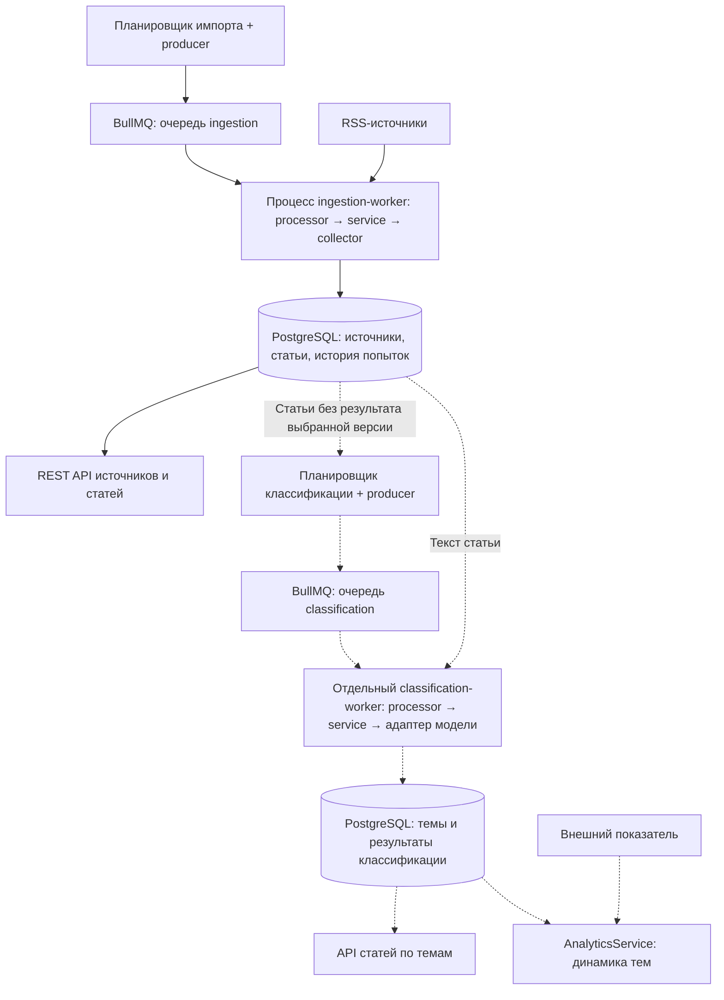

# Media Monitor

Асинхронный backend для сбора новостей и исследования новостной повестки: **TypeScript · Node.js · NestJS · PostgreSQL · BullMQ · Redis**.

Цель — сопоставлять изменения активности конкретных новостных тем с экономическими и финансовыми показателями. Планируемый сценарий: выбрать показатель и период, увидеть изменение доли тем относительно предыдущего периода и открыть статьи, стоящие за изменением. Это инструмент мониторинга и постановки гипотез, а не доказательство причинности или торговая система.

**Сейчас работает ingestion-контур:** REST API, планировщик, отдельный worker, обработка частичных сбоев, идемпотентное сохранение статей и история попыток в PostgreSQL. Классификация исследуется отдельно и ещё не интегрирована; финансовые данные, аналитические endpoint и UI — следующие этапы. Проект активно разрабатывается и пока не готов к публичному production-развёртыванию.

Проект используется для углублённой практики backend-разработки: SQL и ограничения данных, внешние интеграции, очереди, жизненный цикл ресурсов и явные контракты ошибок. Ниже отдельно обозначены работающая система и целевая архитектура.

## Направление развития

Целевой пользовательский сценарий: **открыть тему → изучить статьи → увидеть динамику внимания к теме → сопоставить её с выбранным показателем**. За агрегатами должны оставаться доступными исходные публикации, а неполнота сбора и классификации — быть видимой.

| Этап | Состояние | Результат |
|---|---|---|
| Сбор и хранение новостей | Реализовано | RSS, отдельный worker, повторы, дедупликация, история попыток с диагностикой |
| Классификация | Отдельный локальный прототип; интеграция запланирована | Фоновая обработка статей, сохранение тем и версии классификатора без обязательного внешнего LLM API |
| Тематическая выдача | Запланировано | Статьи по теме с пагинацией и фильтрами по дате и источнику; просмотр статей без назначенных тем |
| Аналитика повестки | Запланировано | Количество и доля статей по темам во времени с учётом покрытия классификацией |
| Сопоставление с показателем | Запланировано | Один экономический или финансовый ряд и просмотр новостей перед выбранным изменением |

### Целевая архитектура

Сплошные связи — существующий ingestion-контур. Пунктир — планируемая классификация и аналитика; это не уже реализованные компоненты.



Обе очереди используют Redis; оба блока PostgreSQL обозначают одну базу, а не отдельные серверы. Сейчас запускаются два процесса: API с планировщиком и ingestion-worker. Планируется третий — classification-worker, который загружает модель один раз и начинает с одного активного задания (`concurrency: 1`). Это не ограничение числа внутренних CPU-потоков модели. Проект остаётся модульным монолитом в одном репозитории.

Для первой интеграции планируется периодический запуск producer классификации через cron. Он выбирает ограниченную порцию статей и ставит **отдельное задание с `articleId` на каждую статью**, с защитой от повторной постановки. Период и размер порции будут настроены после замера. Тот же механизм обработает накопленный архив: если после сохранения статьи очередь недоступна, следующий проход снова найдёт её. Исчерпание попыток задания должно быть различимо с отсутствием задания — cron не должен создавать бесконечные повторы постоянной ошибки.

Планируемое хранение: `topics` — справочник, `article_classifications` — результат для статьи и версии классификатора, `article_classification_topics` — назначенные темы и оценки. Одна статья может иметь несколько тем; завершённая классификация без тем отличается от ещё не обработанной статьи. Результат и связи сохраняются одной транзакцией. Версия охватывает модель, таксономию, подготовку текста, правила и пороги; API и аналитика выбирают конкретную версию, не смешивая повторные результаты.

## Навигация по коду

| Что посмотреть | Реализация |
|---|---|
| Оркестрация попытки, результаты задания и ошибки | [NewsIngestionProcessor](src/news-ingestion/news-ingestion.processor.ts) |
| Сбор и сохранение, частичные счётчики | [NewsIngestionService](src/news-ingestion/news-ingestion.service.ts) |
| Расширяемые адаптеры и Nest Discovery | [CollectorsRegistry](src/collectors/collectors.registry.ts) |
| Валидация внешних данных и нормализация RSS | [RssCollector](src/rss/rss.collector.ts) |
| Параметризованный SQL и конфликт уникальности | [ArticlesRepository](src/articles/repositories/articles.repository.ts) |
| История попыток | [IngestionRunsRepository](src/ingestion-runs/ingestion-runs.repository.ts) |
| Ограничения и связи данных | [schema.sql](src/database/schemas/schema.sql) |

## Почему так устроено

- **Модульный монолит, два процесса.** HTTP API и планировщик не выполняют сетевой сбор; worker использует те же бизнес-модули в отдельном Nest application context. Это не набор микросервисов.
- **BullMQ для фоновых задач.** Redis хранит состояние заданий, PostgreSQL — статьи, источники и историю попыток. Эти хранилища решают разные задачи.
- **Идемпотентность на уровне БД.** Повторное выполнение задания ожидаемо; уникальное ограничение защищает записи независимо от предварительной проверки в коде.
- **Частичный результат вместо транзакции на весь фид.** Уже сохранённые статьи остаются при последующей ошибке; счётчики отражают выполненную работу.
- **Репозитории с явным SQL.** ORM пока не используется: схема, запросы и ограничения доступны для непосредственного изучения и проверки.

## Что работает

- REST API для создания, просмотра, включения и отключения источников.
- Постановка заданий импорта RSS при запуске приложения и каждые 10 минут; выполнение в отдельном процессе воркера.
- Сохранение заголовка, описания, ссылки, внешнего ID и даты публикации.
- Преобразование HTML-описаний в текст: декодирование сущностей, сохранение абзацев, удаление крайних пробелов; адреса ссылок не добавляются к тексту.
- Обработка одиночных и множественных RSS-записей, валидация полей и отбрасывание некорректных элементов.
- Общий контракт `Collector` / `CollectionResult` / `CollectedItem`; автоматическая регистрация помеченных провайдеров через Nest Discovery.
- Пропуск повторных записей по паре `(external_id, source_id)` через уникальное ограничение PostgreSQL и `ON CONFLICT DO NOTHING`.
- Явный результат создания статьи: `created` или `duplicate`.
- Статистика импорта: `total`, `imported`, `skipped`, `rejected`, `status` (`SUCCESS`, `PARTIAL`, `FAILED`).
- Сохранение частичных счётчиков при ошибке источника и продолжение обработки следующих источников.
- Просмотр и удаление статей через API.
- Таблица `ingestion_runs`: отдельная запись на попытку, время начала и завершения, итоговый статус, счётчики и поля `failure_stage`, `failure_reason`, `error_message`. Это история выполнения, а не только консольные логи.

## Как устроен импорт

```text
NewsIngestionScheduler → Producer → Redis / BullMQ
                                      ↓
                    отдельный worker → Processor
                                      ↓
                           NewsIngestionService
                             ├── CollectorsRegistry → RssCollector
                             ├── ArticlesService → PostgreSQL
                             └── обновление lastCollectedAt
```

На каждый включённый источник ставится отдельное задание. Воркер повторно читает источник и возвращает `SKIPPED`, если он выключен. Успешная или частичная обработка возвращает `PROCESSED` с результатом ingestion; неудача передаётся BullMQ через исключение. При ошибке вставки текущий импорт источника останавливается; ранее сохранённые статьи остаются в базе и при повторном сборе пропускаются как дубликаты. Имена Redis-очереди `news-import` и операции `import-source` сохранены для совместимости; код модуля называется `news-ingestion`.

Registry заполняется в `onModuleInit`: Discovery находит классы с `@Collects(...)`, проверяет тип коллектора и наследование от абстрактного `Collector`. Повторная регистрация типа и некорректный помеченный провайдер останавливают инициализацию. Импортёр не зависит от конкретного RSS-адаптера.

Некорректная RSS-запись отклоняется отдельно; неожиданная ошибка обработки завершает импорт текущего источника. `lastCollectedAt` обновляется при `SUCCESS` и `PARTIAL`, но не при `FAILED`. Это время завершённой обработки, а не гарантия полноты данных источника.

## Надёжность и диагностика

- До трёх попыток задания с exponential backoff: задержки перед повторами — 2 и 4 секунды. Неизвестное имя задания, отсутствующий источник и отклонение всех RSS-записей завершают задание без автоматического повтора. Остальные исключения пока допускают ограниченные повторы.
- До четырёх активных заданий на экземпляр воркера. Это не ограничение запросов в секунду и не общий лимит нескольких процессов.
- Дедупликация по источнику не позволяет добавить второе задание с тем же ключом, пока первое не завершено, включая ожидание автоматического ретрая. После завершения новый плановый сбор разрешён. Это не гарантия выполнения ровно один раз.
- Таймаут RSS-запроса и чтения ответа — 15 секунд. Он не ограничивает весь импорт; ошибка подключения может возникнуть раньше.
- История завершённых заданий в Redis: до суток / 1 000 успешных и до недели / 5 000 проваленных. Очистка выполняется при последующих завершениях, не отдельным таймером. Статьи в PostgreSQL не удаляются.
- Логи содержат источник, ID задания, номер и длительность попытки, счётчики, стадию и причину сбоя. Длительность не включает ожидание в очереди и backoff.
- Если запись начала попытки не удалась, импорт не начинается. Сбой записи завершения или пропуска логируется отдельно и не подменяет исходный результат импорта. Поэтому запись истории может остаться `RUNNING`, даже если работа завершилась; автоматического восстановления пока нет.
- PostgreSQL: до пяти соединений на пул, ожидание соединения до 3 секунд, закрытие простаивающих соединений через 30 секунд, `statement_timeout` — 10 секунд. API и воркер имеют отдельные пулы.
- Включены shutdown hooks: воркер прекращает брать задания и ждёт активные перед закрытием пула PostgreSQL. Аварийное завершение процесса не гарантирует выполнение hooks; остановку с активным заданием ещё предстоит проверить интеграционным тестом.

## Локальный запуск

Требуются Node.js (версия в `.nvmrc`), pnpm (версия закреплена в `package.json`), Docker и Docker Compose.

### 1. Получить проект и зависимости

```bash
git clone https://github.com/naive-algorithm/media-monitor.git
cd media-monitor
nvm use
pnpm install --frozen-lockfile
```

Если не используешь nvm, установи соответствующую версию Node.js другим способом.

### 2. Настроить окружение

Скопируй пример окружения:

```bash
cp .env.example .env
```

Значения ниже соответствуют локальной базе из `compose.yaml`:

```dotenv
DB_HOST=localhost
DB_PORT=5432
DB_USER=admin
DB_PASSWORD=password
DB_NAME=nest_pet
REDIS_HOST=127.0.0.1
REDIS_PORT=6379
PORT=3000
```

Это параметры для локальной разработки. `.env` исключён из Git. Имена базы и контейнера пока сохраняют первоначальное название проекта `nest-pet`.

### 3. Поднять PostgreSQL и Redis, создать таблицы

```bash
docker compose up -d postgres redis
docker compose exec postgres pg_isready -U admin -d nest_pet
docker compose exec redis redis-cli PING
```

Дождись сообщения `accepting connections`, затем **один раз на новой базе** выполни:

```bash
docker compose exec -T postgres psql -U admin -d nest_pet -v ON_ERROR_STOP=1 < src/database/schemas/schema.sql
docker compose exec -T postgres psql -U admin -d nest_pet -v ON_ERROR_STOP=1 < src/database/schemas/seed.sql
```

Seed добавляет BBC News, The Guardian, NYT, NASA, NPR News и Le Monde. Схема и seed не идемпотентны: повторное выполнение на уже подготовленной базе приведёт к ошибкам существующих таблиц или источников. Compose запускает PostgreSQL и Redis; приложение и воркер работают на хосте.

Для существующей базы без полей диагностики в `ingestion_runs` есть ручная SQL-миграция, сохраняющая данные:

```bash
docker compose exec -T postgres psql -U admin -d nest_pet -v ON_ERROR_STOP=1 < src/database/migrations/001_add_ingestion_run_failure.sql
```

Применяй её только один раз к старой схеме. После создания новой базы актуальным `schema.sql` эта миграция **не нужна**: столбцы уже существуют. Автоматического runner и таблицы учёта миграций пока нет.

### 4. Запустить приложение

```bash
pnpm start:dev
```

В отдельном терминале запусти воркер:

```bash
pnpm worker
```

API доступен на `http://localhost:3000`. Планировщик ставит задания на старте и на 00, 10, 20, 30, 40 и 50 минутах каждого часа; загрузку фидов выполняет отдельный воркер. Без воркера задания ждут в Redis. Запуск API всё ещё зависит от успешного подключения инфраструктуры, но не ожидает загрузки фидов. Команда воркера без watch: после изменений его нужно перезапустить. Для получения новостей нужен интернет, результаты отображаются в логах воркера.

```bash
curl http://localhost:3000/sources
curl http://localhost:3000/articles
```

Если статьи не появились, проверь логи импорта и доступность PostgreSQL и источников.

## REST API

| Метод | Путь | Назначение |
|---|---|---|
| `GET` | `/sources` | Все источники |
| `GET` | `/sources/enabled` | Включённые источники |
| `GET` | `/sources/:id` | Один источник |
| `POST` | `/sources` | Создать включённый источник |
| `POST` | `/sources/:id/enable` | Включить источник, ответ `204` |
| `POST` | `/sources/:id/disable` | Отключить источник, ответ `204` |
| `GET` | `/articles` | Все сохранённые статьи |
| `GET` | `/articles/:id` | Одна статья |
| `DELETE` | `/articles/:id` | Удалить статью, ответ `204` |

Тело запроса `POST /sources`:

```json
{
  "name": "Example News",
  "url": "https://example.com/feed.xml",
  "collectorType": "rss"
}
```

URL в примере — заглушка: замени его действующим адресом RSS-ленты. Поддерживается только `collectorType: "rss"`. Новый источник попадёт в следующий запуск импорта; отдельного HTTP endpoint для ручного запуска пока нет.

## Разработка и проверки

```bash
# Проверка типов без генерации файлов
pnpm exec tsc --noEmit --incremental false

# Сборка
pnpm build

# Запуск собранного приложения
pnpm start:prod
```

Шаблонные тесты удалены; содержательные автоматические тесты ещё предстоит добавить. Jest и его конфигурация сохранены, но `pnpm test` и `pnpm test:e2e` сейчас сообщают `No tests found`. Скрипт lint также пока не готов: конфигурации ESLint в репозитории нет.

## Текущие ограничения

- RSS-парсер ожидает структуру `rss.channel.item`; поддерживаются одиночная запись и массив. Требуются заголовок, ссылка, `guid` и допустимая дата публикации. Поддерживается не вся вариативность RSS; Atom пока не реализован.
- Описания очищаются от HTML, но могут содержать служебный текст издателя, например `Continue reading...`. Это не гарантированно полный текст статьи; видео и публикации за пейволлом отдельно не классифицируются.
- Изменившиеся публикации с прежним ID в пределах источника пропускаются. Разные публикации об одном событии не объединяются: дедупликация импорта не является семантической дедупликацией.
- Запись `ingestion_runs` создаётся после чтения источника; ошибки чтения источника в неё не попадают. Пока нет API истории и обработки зависших `RUNNING`. В `error_message` сохраняется верхнеуровневое сообщение; вложенная причина сетевой ошибки доступна в логе, но отдельно в БД не сохраняется. Пагинация API также пока не реализована.
- HTML-сущности в заголовках пока могут оставаться нераскодированными: очистка описаний не означает полноценную нормализацию всех полей.
- Нет ограничения размера загружаемого RSS, rate limiting и централизованной валидации переменных окружения. Дедупликация заданий не заменяет идемпотентность записи статей.
- Нет аутентификации и защиты от SSRF при добавлении URL. Текущая версия предназначена для локальной разработки, а не для открытого доступа к API.

## Инженерные доработки

- Постоянные регрессионные тесты для ingestion, очереди и завершения приложения; CI и рабочая конфигурация lint.
- Нормализация заголовков перед классификацией; проверенная разметка и оценка качества по отдельным темам.
- Централизованная валидация конфигурации и учёт применённых миграций.
- API истории попыток, обработка зависших `RUNNING` и более подробная диагностика ошибок.
- Atom как второй универсальный адаптер — после первого сквозного сценария классификации и аналитики.

До публичного развёртывания: защита управляющих endpoint, проверка внешних URL против SSRF, CI и документированный процесс запуска. Архитектура остаётся модульным монолитом; отдельные процессы API и workers не требуют перехода к микросервисам. Kafka, RabbitMQ и обязательные внешние LLM API в ближайший стек не входят.

Исследовательские скрипты, кеши моделей, локальные выборки и рабочие заметки в `docs/` не входят в публичный репозиторий. Они не требуются для сборки и запуска ingestion. Предварительные результаты экспериментов не заявляются как качество готового продукта.

## Лицензия

[MIT](LICENSE).
