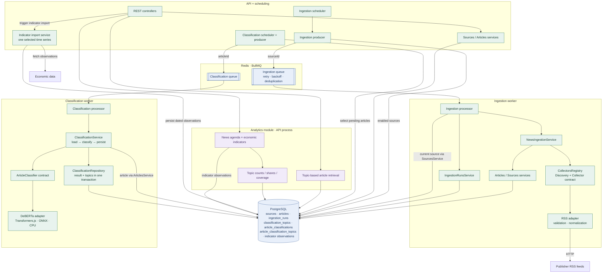

# Media Monitor

Русский | [English](README.en.md)

Backend сервиса медиааналитики: сбор новостей, автоматическая тематическая классификация и исследование связи новостной повестки с экономическими и финансовыми показателями.

**TypeScript · Node.js · NestJS · PostgreSQL · BullMQ · Redis · Transformers.js · ONNX Runtime**

## Назначение и состояние проекта

Целевой сценарий: выбрать показатель и временной интервал, увидеть изменение количества и доли публикаций по темам относительно базового периода, затем перейти к исходным статьям. Сервис ориентирован на мониторинг, исследование и формулирование гипотез; временное совпадение событий не трактуется как доказательство причинности.

Проект находится на ранней стадии активной разработки. Инженерная часть развивается вместе с прикладным R&D в области классификации текстов и анализа медиаданных. MVP объединяет сбор, классификацию, тематическую выдачу и первый аналитический сценарий; после него планируется расширение функциональности и улучшение моделей.

| Подсистема | Текущее состояние |
|---|---|
| Источники и статьи | REST API, PostgreSQL, управление включением источников |
| Сбор новостей | RSS-адаптер, нормализация, очередь, отдельный worker и история попыток |
| Классификация | Локальная модель, отдельная очередь и worker, периодическая постановка, транзакционное сохранение тем |
| Тематическая выдача | Следующий этап: фильтры по теме, источнику, дате и версии классификатора |
| Аналитика | Планируется: временные ряды повестки и сопоставление с одним экономическим показателем |

## Архитектура

Модульный монолит с общей кодовой базой и тремя независимо запускаемыми процессами:

| Процесс | Обязанности |
|---|---|
| API | HTTP endpoints, планировщики сбора и классификации |
| Ingestion worker | Получение фидов, проверка и нормализация, сохранение статей и истории |
| Classification worker | Загрузка модели, обработка статей, сохранение результатов классификации |

Redis хранит задания и их состояния. PostgreSQL хранит предметные данные и историю ingestion. API и ingestion-worker не загружают модель. Каждый процесс создаёт собственный Nest-контекст и пул соединений с БД.

Ниже — **целевая схема полного MVP**, включая ещё разрабатываемые тематический API и аналитику. Текущая готовность компонентов указана в таблице выше.


```mermaid
flowchart TB
    subgraph APP["API + scheduling"]
        API["REST controllers"] --> READ["Sources / Articles services"]
        CRON["Ingestion scheduler"] --> PROD["Ingestion producer"]
        CP["Classification scheduler + producer"]
        IMPORT["Indicator import service<br/>one selected time series"]
    end
    subgraph REDIS["Redis · BullMQ"]
        IQ[["Ingestion queue<br/>retry · backoff · deduplication"]]
        CQ[["Classification queue"]]
    end
    subgraph INGEST["Ingestion worker"]
        IP["Ingestion processor"] --> IS["NewsIngestionService"]
        IP --> HIST["IngestionRunsService"]
        IS --> REG["CollectorsRegistry<br/>Discovery + Collector contract"]
        REG --> RSS["RSS adapter<br/>validation · normalization"]
        IS --> SAVE["Articles / Sources services"]
    end
    subgraph CLASSIFY["Classification worker"]
        PROC["Classification processor"] --> SERVICE["ClassificationService<br/>load → classify → persist"]
        SERVICE --> CONTRACT["ArticleClassifier contract"]
        CONTRACT --> MODEL["DeBERTa adapter<br/>Transformers.js · ONNX · CPU"]
        SERVICE --> REPO["ClassificationRepository<br/>result + topics in one transaction"]
    end
    subgraph ANALYTICS["Analytics module · API process"]
        QUERY["Topic-based article retrieval"]
        SERIES["Topic counts / shares / coverage"]
        COMPARE["News agenda × economic indicators"]
        COMPARE --> SERIES
    end
    DB[("PostgreSQL<br/>sources · articles · ingestion_runs<br/>classification_topics · article_classifications<br/>article_classification_topics · indicator observations")]
    FEEDS["Publisher RSS feeds"]
    IND["Economic data"]
    PROD -->|sourceId| IQ
    PROD -->|enabled sources| DB
    READ --> DB
    IQ --> IP
    RSS -->|HTTP| FEEDS
    SAVE --> DB
    HIST --> DB
    IP -->|current source via SourcesService| DB
    CP -->|articleId| CQ
    CP -->|select pending articles| DB
    CQ --> PROC
    SERVICE -->|article via ArticlesService| DB
    REPO --> DB
    API --> QUERY
    API --> COMPARE
    API -->|trigger indicator import| IMPORT
    QUERY --> DB
    SERIES --> DB
    IMPORT -->|fetch observations| IND
    IMPORT -->|persist dated observations| DB
    COMPARE -->|indicator observations| DB
    classDef application fill:#e8f3ee,stroke:#287653,color:#163b2b
    classDef analysis fill:#f1ebfa,stroke:#7857a1,color:#493565
    classDef storage fill:#e8effa,stroke:#4569a1,color:#20395e
    class API,READ,CRON,PROD,CP,IP,IS,HIST,REG,RSS,SAVE,PROC,SERVICE,CONTRACT,MODEL,REPO,IMPORT application
    class QUERY,SERIES,COMPARE analysis
    class DB,IQ,CQ storage
```

## 1. Источники и сбор новостей

### Источники и коллекторы

Источник содержит название, URL, тип коллектора, признак включения и время последней завершённой обработки. API позволяет добавлять источники и управлять их участием в сборе.

Контракт `Collector` отделяет формат источника от сценария ingestion. `CollectorsRegistry` обнаруживает помеченные реализации через Nest Discovery и выбирает коллектор по типу источника. Сейчас реализован RSS; другие форматы подключаются адаптерами к тому же выходному контракту.

RSS-адаптер разбирает `rss.channel.item`, принимает одну запись или массив, проверяет поля и преобразует HTML заголовка и описания в текст. Обязательны содержательный заголовок, ссылка, внешний идентификатор и корректная дата публикации. Внешний ID сохраняется как идентификатор источника, а не как семантический отпечаток статьи.

Входом служит содержимое фида: описание может быть аннотацией, а не полным текстом. Издательские хвосты и различия форматов относятся к дальнейшему развитию нормализации; загрузка страниц за paywall не выполняется.

### Выполнение и сохранение

Планировщик на старте API и каждые 10 минут ставит по заданию на включённый источник. Processor перечитывает источник перед выполнением, учитывает его актуальное состояние и вызывает `NewsIngestionService`.

Статьи сохраняются независимо: сбой после нескольких записей не откатывает уже сохранённые публикации. Ограничение `UNIQUE (external_id, source_id)` и `ON CONFLICT DO NOTHING` делают повторную доставку безопасной для данных. Публикации с тем же ID пропускаются; материалы разных источников об одном событии остаются самостоятельными статьями.

Итог включает статус и счётчики полученных, сохранённых, пропущенных и отклонённых записей. `lastCollectedAt` отмечает завершённую обработку источника, а не гарантированную полноту его новостного архива.

### Очередь и диагностика

| Параметр | Значение |
|---|---|
| Параллельность | До 4 заданий на экземпляр worker |
| Попытки | До 3; exponential backoff 2 и 4 секунды |
| HTTP timeout | 15 секунд на запрос и чтение ответа |
| Дедупликация заданий | По источнику, пока предыдущее задание не завершено |
| Хранение заданий Redis | Completed: до суток / 1 000; failed: до недели / 5 000 |
| История | `ingestion_runs` в PostgreSQL, отдельная запись попытки |

Неизвестная операция, отсутствующий источник и отклонение всех элементов завершают задание без автоматического повтора. Другие технические исключения допускают ограниченные ретраи. Очистка старых заданий Redis происходит при последующих завершениях; статьи при этом не удаляются.

Логи содержат источник, job ID, попытку, длительность, счётчики и причину сбоя. Неудачная запись начала истории останавливает импорт; ошибка записи завершения логируется отдельно и не подменяет исходный результат. После аварии запись может остаться `RUNNING`; её восстановление входит в план развития истории.

Код: [registry](src/collectors/collectors.registry.ts), [RSS adapter](src/collectors/adapters/rss/rss.collector.ts), [processor](src/news-ingestion/news-ingestion.processor.ts).

## 2. Классификация

### Модель и входные данные

Контракт `ArticleClassifier` отделяет сценарий обработки от конкретной модели. Текущая реализация — `DebertaClassifierAdapter`: zero-shot-классификация английских текстов через Transformers.js и ONNX Runtime, без внешнего LLM API.

| Параметр | Текущая конфигурация |
|---|---|
| Модель | `MoritzLaurer/deberta-v3-base-zeroshot-v2.0`, закреплённая ревизия |
| Исполнение | CPU, FP32, один вычислительный поток intra-op и inter-op |
| Таксономия | 40 тем из выбранного и адаптированного поднабора IPTC Media Topics |
| Вход | Заголовок и до 1 200 символов описания |
| Решение | Несколько тем со score ≥ 0.8 либо `UNCLASSIFIED` |
| Версия | `0.1.0` |

Модель сопоставляет текст с описаниями категорий. Score используется для отбора тем, но не является калиброванной вероятностью правильного ответа. `UNCLASSIFIED` означает успешную обработку без принятых назначений, а не техническую ошибку.

Модель загружается один раз при инициализации worker и переиспользуется. Путь к весам задаётся `CLASSIFIER_CACHE_DIR`, по умолчанию `.cache/models/deberta`. Веса распространяются отдельно; автоматическое скачивание при обычном запуске отключено.

### Постановка и выполнение заданий

Планировщик в API работает на старте и каждые 10 минут. Producer выбирает до 350 статей без результата **целевой версии**, в порядке ID. Это размер выборки, не требование обработать её за 10 минут.

Задание содержит `articleId` и `classifierVersion`. Постоянный ID `article-ID-v-VERSION` и ключ дедупликации защищают от повторной постановки одной работы. Повторный проход планировщика не создаёт новую пачку дубликатов. Локальный флаг исключает наложение проходов в одном API-процессе.

Worker обрабатывает по одной статье: загрузка из БД → модель → транзакционное сохранение. Обработка начинается после готовности модели. При штатной остановке worker прекращает брать задания и дожидается активного перед освобождением модели и БД.

Processor проверяет имя операции и версию; отсутствующая статья не повторяется. Остальные технические ошибки допускают до трёх попыток с backoff. Итоговые логи содержат статью, версию, задание, попытку, длительность и статус. События `error` самого worker логируются отдельно от ошибок обработки статьи.

### Данные и повторное выполнение

| Таблица | Назначение |
|---|---|
| `classification_topics` | Справочник кодов и названий тем |
| `article_classifications` | Результат для пары «статья — версия», статус и время |
| `article_classification_topics` | Назначенные этому результату темы и score |

Inference выполняется **вне SQL-транзакции**. Репозиторий делает UPSERT результата, удаляет прежние назначения и сохраняет новый набор в одной транзакции. При неудаче изменения откатываются; если сам rollback тоже не удался, обе ошибки сохраняются, а соединение исключается из пула.

Окончательно проваленные задания остаются в Redis для диагностики и явного повторного допуска. Пока такой job ID существует, cron не создаёт новое задание с новым счётчиком попыток. Удаление задания или очистка Redis снимают эту защиту; успешные предметные результаты независимо сохраняются в PostgreSQL.

Текущая выборка ориентирована на ограниченный корпус: ожидающие и failed-задания могут занимать места в первых 350 кандидатах. Для больших архивов следующий шаг — учёт состояния обработки при выборке, управление размером очереди и история попыток в PostgreSQL.

### R&D и оценка качества

Проводились эксперименты с zero-shot DeBERTa, сходством embeddings статей и описаний тем, несколькими аспектами категории, размерами таксономии и порогами. Текущий адаптер использует модель без экспериментальных правил.

Следующий цикл исследований: проверенная разметка, независимая контрольная выборка, уточнение описаний категорий и пороги по темам. Сравнение учитывает precision / recall / F1, качество отдельных тем, покрытие, задержку и память. Исторические оценки на небольших выборках не выдаются за точность текущего адаптера.

Классификация находится на экспериментальной стадии: результаты доступны для изучения и проверки, качество назначений развивается отдельно от технической интеграции.

Код: [processor](src/classification/queue/classification.processor.ts), [service](src/classification/classification.service.ts), [adapter](src/classification/adapters/deberta/deberta-classifier.adapter.ts), [repository](src/classification/classification.repository.ts).

## 3. Тематическая выдача и аналитика

**Следующий этап MVP.** Результаты классификации уже хранятся в БД; тематические endpoints и аналитические агрегаты ещё разрабатываются.

Планируемый сценарий:

1. Выдача статей по темам, источникам, датам и версии классификатора, с пагинацией и доступом к `UNCLASSIFIED`.
2. Временные ряды количества публикаций и доли каждой темы, с явно заданным корпусом и знаменателем доли.
3. Сравнение с базовым периодом, отображение покрытия классификацией и доступности источников.
4. Импорт одного экономического или финансового ряда и его сопоставление с динамикой повестки.
5. Переход от точки графика к публикациям, на которых построен агрегат.

Версии классификатора учитываются отдельно, чтобы смена модели не выглядела как изменение повестки. Метрики описывают наблюдаемые источники, а не все мировые новости. Цель — исследование и проверка гипотез, не автоматические торговые рекомендации.

## 4. Инфраструктура и организация кода

Код сгруппирован по функциональности: `sources`, `articles`, `collectors`, `news-ingestion`, `classification`. Внутри модулей выделены адаптеры, очереди и планирование. Processor и scheduler запускают сценарии, service координирует работу, repository выполняет параметризованный SQL.

`database` содержит общий способ создания пула и SQL-схемы; `queue-infrastructure` — настройки подключения BullMQ к Redis. Корневые `AppModule`, `IngestionWorkerModule` и `ClassificationWorkerModule` собирают приложения для соответствующих процессов. Межмодульные вызовы идут через экспортируемые сервисы.

PostgreSQL: до 5 соединений на пул процесса, ожидание соединения до 3 секунд, idle timeout 30 секунд, statement timeout 10 секунд. Redis в Compose использует AOF и `noeviction`. Модель и приватные настройки не входят в репозиторий.

Имена файлов — kebab-case с ролью (`.service.ts`, `.repository.ts`, `.adapter.ts`). Связанные типы объединяются; дополнительные папки вводятся по ответственности, а не для каждого отдельного типа.

### Развёртывание и эксплуатация

Текущий запуск рассчитан на локальную среду с доверенными источниками. Перед публичным доступом к управляющему API потребуются аутентификация, защита URL-запросов от SSRF и лимиты. Пагинация общего списка статей, централизованная валидация окружения, учёт миграций и CI входят в инженерный backlog. Штатные shutdown hooks не заменяют обработку аварийного завершения процесса.

## Локальный запуск

Требуются Node.js (версия в `.nvmrc`), pnpm (версия закреплена в `package.json`), Docker и Docker Compose.

### 1. Получить проект и зависимости

```bash
git clone https://github.com/naive-algorithm/media-monitor.git
cd media-monitor
nvm use
pnpm install --frozen-lockfile
```

Если не используешь nvm, установи соответствующую версию Node.js другим способом.

### 2. Настроить окружение

Скопируй пример окружения:

```bash
cp .env.example .env
```

Значения ниже соответствуют локальной базе из `compose.yaml`:

```dotenv
DB_HOST=localhost
DB_PORT=5432
DB_USER=admin
DB_PASSWORD=password
DB_NAME=nest_pet
REDIS_HOST=127.0.0.1
REDIS_PORT=6379
PORT=3000
```

Это параметры для локальной разработки. `.env` исключён из Git. Имена базы и контейнера пока сохраняют первоначальное название проекта `nest-pet`.

### 3. Поднять PostgreSQL и Redis, создать таблицы

```bash
docker compose up -d postgres redis
docker compose exec postgres pg_isready -U admin -d nest_pet
docker compose exec redis redis-cli PING
```

Дождись сообщения `accepting connections`, затем **один раз на новой базе** выполни:

```bash
docker compose exec -T postgres psql -U admin -d nest_pet -v ON_ERROR_STOP=1 < src/database/schemas/schema.sql
docker compose exec -T postgres psql -U admin -d nest_pet -v ON_ERROR_STOP=1 < src/database/schemas/seed.sql
docker compose exec -T postgres psql -U admin -d nest_pet -v ON_ERROR_STOP=1 < src/database/schemas/seed-topics.sql
```

`seed-topics.sql` добавляет 40 тем классификации; существующие коды пропускаются. Seed источников добавляет BBC News, The Guardian, NYT, NASA, NPR News и Le Monde. Схема и seed не идемпотентны: повторное выполнение на уже подготовленной базе приведёт к ошибкам существующих таблиц или источников. Compose запускает PostgreSQL и Redis; приложение и воркер работают на хосте.

Для существующей базы без полей диагностики в `ingestion_runs` есть ручная SQL-миграция, сохраняющая данные:

```bash
docker compose exec -T postgres psql -U admin -d nest_pet -v ON_ERROR_STOP=1 < src/database/migrations/001_add_ingestion_run_failure.sql
```

Применяй её только один раз к старой схеме. После создания новой базы актуальным `schema.sql` эта миграция **не нужна**: столбцы уже существуют. Автоматического runner и таблицы учёта миграций пока нет.

### 4. Запустить приложение

```bash
pnpm start:dev
```

В отдельном терминале запусти воркер:

```bash
pnpm worker:ingestion
```

Для классификации запусти ещё один процесс (после подготовки локальных весов модели):

```bash
pnpm worker:classification
```

Классификационные задания ставятся API на старте и каждые 10 минут; без этого worker они остаются в Redis. Результаты доступны в таблицах классификации, тематический REST API ещё не реализован. После изменения кода worker нужно перезапустить.

API доступен на `http://localhost:3000`. Все три процесса запускаются отдельно; без соответствующего worker задания остаются в Redis. Запуск API ожидает постановки стартовых заданий, но не загрузки фидов или inference. Команды worker работают без watch.

```bash
curl http://localhost:3000/sources
curl http://localhost:3000/articles
```

Если статьи не появились, проверь логи импорта и доступность PostgreSQL и источников.

## REST API

| Метод | Путь | Назначение |
|---|---|---|
| `GET` | `/sources` | Все источники |
| `GET` | `/sources/enabled` | Включённые источники |
| `GET` | `/sources/:id` | Один источник |
| `POST` | `/sources` | Создать включённый источник |
| `POST` | `/sources/:id/enable` | Включить источник, ответ `204` |
| `POST` | `/sources/:id/disable` | Отключить источник, ответ `204` |
| `GET` | `/articles` | Все сохранённые статьи |
| `GET` | `/articles/:id` | Одна статья |
| `DELETE` | `/articles/:id` | Удалить статью, ответ `204` |

Тело запроса `POST /sources`:

```json
{
  "name": "Example News",
  "url": "https://example.com/feed.xml",
  "collectorType": "rss"
}
```

URL в примере — заглушка: замени его действующим адресом RSS-ленты. Поддерживается только `collectorType: "rss"`. Новый источник попадёт в следующий запуск импорта; отдельного HTTP endpoint для ручного запуска пока нет.

## Проверки и разработка

```bash
pnpm exec tsc --noEmit --incremental false
pnpm build
pnpm test --runInBand
```

57 unit-тестов покрывают нормализацию RSS, ingestion, транзакционную последовательность сохранения классификации, ошибки сервиса, поведение адаптера, producer, processor и защиту планировщика от наложения проходов. Внешние зависимости подменяются: веса модели, сеть, Redis и PostgreSQL для unit-тестов не требуются.

Дополнительно проводился изолированный smoke-прогон BullMQ с реальным Redis: ручной старт worker, успешное выполнение, исчерпание повторов и сохранение failed-job при повторной постановке того же ID. Автоматизация интеграционных сценариев и оценка качества ML — отдельные направления проверки.

Запуск собранных процессов в отдельных терминалах:

```bash
pnpm start:prod
node dist/ingestion-worker.js
node dist/classification-worker.js
```

## Следующие этапы

1. Завершить историю классификационных попыток и управление повторным допуском.
2. Реализовать тематическую выдачу с фильтрами и пагинацией.
3. Построить временные ряды количества, доли тем и покрытия.
4. Подключить один экономический показатель и исследовательское сопоставление.
5. Развивать качество классификатора на проверенной разметке, расширять источники и форматы.

После MVP — более широкий набор аналитических сценариев, воспроизводимые ML-эксперименты и эксплуатационное укрепление системы.

## Лицензия

Код: [MIT](LICENSE). Таксономия содержит адаптированные данные [IPTC Media Topics](https://cv.iptc.org/newscodes/mediatopic/) под CC BY 4.0; атрибуция сохранена в JSON. Веса модели распространяются отдельно на условиях её репозитория.
