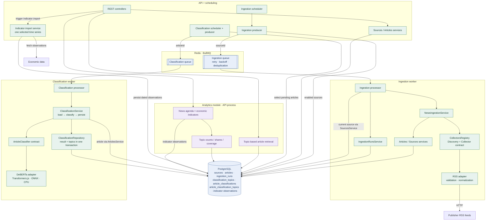

# Media Monitor

Русский | [English](README.en.md)

Backend сервиса медиааналитики: сбор новостей из разных источников, тематический мониторинг и исследование связи новостной повестки с экономическими и финансовыми показателями.

**TypeScript · Node.js · NestJS · PostgreSQL · BullMQ · Redis**

## Назначение

Media Monitor разрабатывается для исследования изменений новостной повестки в периоды движения экономических и финансовых показателей. Целевой сценарий: выбрать показатель и временное окно, увидеть темы, доля которых выросла относительно базового периода, и перейти к соответствующим публикациям.

Система собирает корпус новостей с указанием источника и времени публикации. Следующие этапы — тематическая выдача, временные ряды количества и доли публикаций и сопоставление с выбранным показателем. Анализ охватывает общую повестку, не только экономические материалы; его выводы ограничены наблюдаемым корпусом и не устанавливают причинность.

Проект находится на ранней стадии активной разработки и сочетает создание аналитического сервиса с прикладным R&D: экспериментами с ML-классификацией, таксономией и методами анализа новостных данных. MVP — первый завершённый этап, а не конечная версия. После него планируется расширять аналитические сценарии, улучшать качество классификации и эксплуатационную надёжность.

## Текущее состояние

| Компонент | Что доступно сейчас |
|---|---|
| Сбор новостей | Автономный RSS-ingestion: планировщик, BullMQ, отдельный worker, нормализация и дедупликация |
| API и диагностика | Управление источниками, просмотр статей, история попыток в PostgreSQL и логи с контекстом ошибок |
| Классификация | Минимальный сквозной сценарий: статья из БД → локальная модель → результат и темы в одной транзакции; проверен ручными прогонами |
| Фоновая классификация | Producer с версионированными заданиями и ограниченной выборкой реализован; scheduler и отдельный worker ещё не подключены |
| Тематическая выдача и аналитика | Запланированы |

Обычный запуск поднимает API и ingestion-worker без загрузки модели. Текущая версия предназначена для локальной работы с доверенными источниками, не для публичного доступа к управляющему API.

## Целевая архитектура MVP

Модульный монолит с отдельными процессами API и фоновой обработки, общей кодовой базой и PostgreSQL. Redis хранит состояние заданий BullMQ; PostgreSQL — статьи, источники, историю попыток и результаты классификации.

Схема показывает **полный целевой MVP**, а не текущую готовность: от сбора новостей и классификации до тематической выдачи и сопоставления с одним экономическим или финансовым показателем. Статус реализации указан выше. Группы обозначают процессы, цвета — назначение компонентов. Стрелки показывают вызовы и доступ к данным; все обращения к PostgreSQL проходят через репозитории, часть промежуточных слоёв опущена.


```mermaid
flowchart TB
    subgraph APP["API + scheduling"]
        API["REST controllers"] --> READ["Sources / Articles services"]
        CRON["Ingestion scheduler"] --> PROD["Ingestion producer"]
        CP["Classification scheduler + producer"]
        IMPORT["Indicator import service<br/>one selected time series"]
    end
    subgraph REDIS["Redis · BullMQ"]
        IQ[["Ingestion queue<br/>retry · backoff · deduplication"]]
        CQ[["Classification queue"]]
    end
    subgraph INGEST["Ingestion worker"]
        IP["Ingestion processor"] --> IS["NewsIngestionService"]
        IP --> HIST["IngestionRunsService"]
        IS --> REG["CollectorsRegistry<br/>Discovery + Collector contract"]
        REG --> RSS["RSS adapter<br/>validation · normalization"]
        IS --> SAVE["Articles / Sources services"]
    end
    subgraph CLASSIFY["Classification worker"]
        PROC["Classification processor"] --> SERVICE["ClassificationService<br/>load → classify → persist"]
        SERVICE --> CONTRACT["ArticleClassifier contract"]
        CONTRACT --> MODEL["DeBERTa adapter<br/>Transformers.js · ONNX · CPU"]
        SERVICE --> REPO["ClassificationRepository<br/>result + topics in one transaction"]
    end
    subgraph ANALYTICS["Analytics module · API process"]
        QUERY["Topic-based article retrieval"]
        SERIES["Topic counts / shares / coverage"]
        COMPARE["News agenda × economic indicators"]
        COMPARE --> SERIES
    end
    DB[("PostgreSQL<br/>sources · articles · ingestion_runs<br/>classification_topics · article_classifications<br/>article_classification_topics · indicator observations")]
    FEEDS["Publisher RSS feeds"]
    IND["Economic data"]
    PROD -->|sourceId| IQ
    PROD -->|enabled sources| DB
    READ --> DB
    IQ --> IP
    RSS -->|HTTP| FEEDS
    SAVE --> DB
    HIST --> DB
    IP -->|current source via SourcesService| DB
    CP -->|articleId| CQ
    CP -->|select pending articles| DB
    CQ --> PROC
    SERVICE -->|article via ArticlesService| DB
    REPO --> DB
    API --> QUERY
    API --> COMPARE
    API -->|trigger indicator import| IMPORT
    QUERY --> DB
    SERIES --> DB
    IMPORT -->|fetch observations| IND
    IMPORT -->|persist dated observations| DB
    COMPARE -->|indicator observations| DB
    classDef application fill:#e8f3ee,stroke:#287653,color:#163b2b
    classDef analysis fill:#f1ebfa,stroke:#7857a1,color:#493565
    classDef storage fill:#e8effa,stroke:#4569a1,color:#20395e
    class API,READ,CRON,PROD,CP,IP,IS,HIST,REG,RSS,SAVE,PROC,SERVICE,CONTRACT,MODEL,REPO,IMPORT application
    class QUERY,SERIES,COMPARE analysis
    class DB,IQ,CQ storage
```

### Реализованный контур сбора

Планировщик ставит отдельное задание на каждый включённый источник. Processor перечитывает его состояние, вызывает сервис сбора и записывает итог попытки. `CollectorsRegistry` обнаруживает реализации контракта `Collector` через Nest Discovery; RSS-адаптер валидирует внешние данные и преобразует HTML в текст.

Статьи сохраняются независимо: сбой в середине фида не откатывает уже выполненную работу. Уникальность `(external_id, source_id)` и `ON CONFLICT DO NOTHING` защищают от дублей при повторном выполнении. Ошибки передаются BullMQ исключениями; частичный результат сохраняет счётчики обработанных записей. `lastCollectedAt` отмечает завершённую обработку, не гарантированную полноту фида.

### Классификация

`ClassificationService` загружает статью через `ArticlesService`, вызывает контракт `ArticleClassifier` и передаёт результат репозиторию. Вычисление модели происходит **до** открытия транзакции. Ошибка сохраняет ID статьи, стадию выполнения и исходную причину.

- `classification_topics` — справочник тем.
- `article_classifications` — результат для статьи и версии классификатора.
- `article_classification_topics` — назначенные темы и оценки.

Результат и темы записываются атомарно. `UNCLASSIFIED` — успешная обработка без назначенных тем, а не технический сбой. UPSERT по паре «статья — версия» заменяет статус и набор назначений в одной транзакции. Если откат тоже завершается ошибкой, сохраняются обе причины, а клиент удаляется из пула.

`ClassificationProducerModule` содержит producer и регистрацию очереди, не загружая модель. Файлы этого контура находятся в `classification/queue`. `ClassificationModule` отвечает за выполнение классификации и сохранение. Producer выбирает статьи без результата целевой версии, передаёт её в задании и включает в ключ дедупликации. Версия алгоритма задаётся в конфигурации адаптера; `classification.config.ts` выбирает её как `TARGET_CLASSIFIER_VERSION`. Обработка окончательно проваленных заданий перед повторной постановкой остаётся следующей задачей.

Для фоновой интеграции планируется отдельный worker с `concurrency: 1` и периодический producer, который выбирает ограниченную порцию необработанных статей и ставит по заданию на `articleId`. Это позволит обрабатывать и новые публикации, и накопленный архив. Число заданий и число вычислительных потоков модели настраиваются независимо.

### Параметры ingestion и диагностика

<details>
<summary>Повторы, ограничения, история попыток и завершение процессов</summary>

- До трёх попыток задания с exponential backoff: задержки перед повторами — 2 и 4 секунды. Неизвестное имя задания, отсутствующий источник и отклонение всех RSS-записей завершают задание без автоматического повтора. Остальные исключения пока допускают ограниченные повторы.
- До четырёх активных заданий на экземпляр воркера. Это не ограничение запросов в секунду и не общий лимит нескольких процессов.
- Дедупликация по источнику не позволяет добавить второе задание с тем же ключом, пока первое не завершено, включая ожидание автоматического ретрая. После завершения новый плановый сбор разрешён. Это не гарантия выполнения ровно один раз.
- Таймаут RSS-запроса и чтения ответа — 15 секунд. Он не ограничивает весь импорт; ошибка подключения может возникнуть раньше.
- История завершённых заданий в Redis: до суток / 1 000 успешных и до недели / 5 000 проваленных. Очистка выполняется при последующих завершениях, не отдельным таймером. Статьи в PostgreSQL не удаляются.
- Логи содержат источник, ID задания, номер и длительность попытки, счётчики, стадию и причину сбоя. Длительность не включает ожидание в очереди и backoff.
- Если запись начала попытки не удалась, импорт не начинается. Сбой записи завершения или пропуска логируется отдельно и не подменяет исходный результат импорта. Поэтому запись истории может остаться `RUNNING`, даже если работа завершилась; автоматического восстановления пока нет.
- PostgreSQL: до пяти соединений на пул, ожидание соединения до 3 секунд, закрытие простаивающих соединений через 30 секунд, `statement_timeout` — 10 секунд. API и воркер имеют отдельные пулы.
- Включены shutdown hooks для завершения worker и закрытия пула PostgreSQL. Аварийное завершение процесса не гарантирует выполнение hooks; остановку с активным заданием ещё предстоит проверить интеграционным тестом.

</details>

## Модель и R&D классификации

Адаптер [DebertaClassifierAdapter](src/classification/adapters/deberta/deberta-classifier.adapter.ts) реализует контракт `ArticleClassifier` и выполняет zero-shot-классификацию английских заголовков и RSS-аннотаций через Transformers.js и ONNX Runtime. Используется DeBERTa с закреплённой ревизией, CPU и FP32; внешние LLM API не требуются.

- 40 категорий из выбранного и адаптированного поднабора IPTC Media Topics; возможны несколько тем для одной статьи.
- Вход — нормализованный заголовок и до 1200 символов описания. Текущая версия `0.1.0` принимает темы с оценкой не ниже `0.8`, без дополнительных правил по ключевым словам.
- Результат — темы с оценками и версия классификатора либо `UNCLASSIFIED`. Отсутствие подходящих тем не считается техническим сбоем; оценка модели не является калиброванной вероятностью.
- Модель загружается при инициализации адаптера и переиспользуется. Веса не входят в репозиторий; путь задаётся `CLASSIFIER_CACHE_DIR`, по умолчанию `.cache/models/deberta`. Загрузка из сети при обычном запуске отключена.

### Проведённые эксперименты

Сравнивались варианты zero-shot DeBERTa и классификация через сходство embeddings статей и описаний тем, включая несколько аспектов категории. Проверялись размер таксономии, формулировки категорий, пороги и дополнительные правила. Для текущей интеграции выбран DeBERTa-base; экспериментальные правила не входят в адаптер приложения.

### Направления улучшения

- Уточнение границ тем и расширение таксономии по систематическим пропускам и ложным назначениям.
- Проверенная разметка, раздельные наборы для настройки и итоговой проверки без пересечения близких публикаций об одном событии.
- Оценка precision / recall / F1 по назначениям «статья — тема», качества отдельных тем и доли статей без меток — вместе с памятью и временем обработки.
- Сравнение порогов по темам, описаний аспектов, гибридных подходов и альтернативных моделей в сопоставимом вычислительном бюджете. Накопленная исправленная разметка впоследствии может стать основой обучения или дообучения.

Исторические эксперименты использовали небольшие выборки с предварительной, в том числе подготовленной ИИ, разметкой. Они помогают выбирать гипотезы, но не подтверждают точность текущего адаптера. Исследовательский контур пока не оформлен как воспроизводимый benchmark; штатный сценарий подготовки весов также предстоит добавить.

## Дальнейшее развитие

1. **Фоновая классификация:** отдельная очередь и worker, идемпотентное сохранение при повторах, согласованное завершение worker и модели.
2. **Тематическая выдача:** статьи по теме, источнику и периоду, пагинация, просмотр материалов без меток и анализ ошибок классификатора.
3. **Аналитика повестки:** количество и доля публикаций по темам, базовый период для сравнения, показатели полноты сбора и покрытия классификацией.
4. **Сопоставление с показателем:** один экономический или финансовый временной ряд и просмотр новостей вокруг выбранного изменения, без смешивания версий классификатора.

Параллельные инженерные задачи: регрессионные тесты и CI, рабочий lint, централизованная валидация конфигурации, учёт миграций и восстановление зависших записей истории. Atom — следующий универсальный адаптер после первого сквозного аналитического сценария.

## Структура и конвенции

Код сгруппирован по функциональным модулям, внутри — по ответственности. Границы задаются импортами и экспортами Nest; автоматических проверок этих границ пока нет.

- **Функциональные модули:** `sources`, `articles`, `news-ingestion`, `classification` владеют своими сценариями и доступом к данным.
- **Интеграции:** `collectors` задаёт контракт и реестр, `collectors/adapters/rss` реализует сборщик; `classification/adapters/deberta` содержит конкретный классификатор. Таксономия хранится отдельно от адаптера.
- **Инфраструктура:** `database` управляет пулом и SQL-схемами, `queue-infrastructure` — общими настройками BullMQ. `common` предназначен для небольших общих утилит, не для бизнес-логики.
- **Сборка процессов:** `AppModule` и `IngestionWorkerModule` подключают нужные модули и провайдеры. Планировщик и processor инициируют сценарии; сервис оркестрирует их; репозиторий выполняет SQL. Межмодульные вызовы идут через экспортированные сервисы, а не через чужие репозитории.
- **Конвенции:** kebab-case, суффиксы по роли (`.service.ts`, `.repository.ts`, `.adapter.ts`, `.error.ts`). Связанные типы хранятся вместе; подкаталоги выделяются для адаптеров, DTO и ошибок, без обязательного дерева слоёв в каждом модуле.

История попыток и расписание находятся в `news-ingestion/runs` и `news-ingestion/scheduling`. Точка входа ingestion-worker — `src/ingestion-worker.ts`; `pnpm worker` сохранён как алиас для `pnpm worker:ingestion`. Настройки модели и классификации собраны в `classification/adapters/deberta/deberta-classifier.config.ts`, путь к кэшу задаётся окружением.

### Навигация по коду

| Что посмотреть | Реализация |
|---|---|
| Оркестрация попытки, результаты задания и ошибки | [NewsIngestionProcessor](src/news-ingestion/news-ingestion.processor.ts) |
| Расширяемые адаптеры и Nest Discovery | [CollectorsRegistry](src/collectors/collectors.registry.ts) |
| Валидация внешних данных и нормализация RSS | [RssCollector](src/collectors/adapters/rss/rss.collector.ts) |
| Zero-shot-классификация и lifecycle модели | [DebertaClassifierAdapter](src/classification/adapters/deberta/deberta-classifier.adapter.ts) |
| Сценарий классификации и контекст ошибки | [ClassificationService](src/classification/classification.service.ts) |
| Транзакция результата и тем | [ClassificationRepository](src/classification/classification.repository.ts) |
| Ограничения и связи данных | [schema.sql](src/database/schemas/schema.sql) |

## Локальный запуск

Требуются Node.js (версия в `.nvmrc`), pnpm (версия закреплена в `package.json`), Docker и Docker Compose.

### 1. Получить проект и зависимости

```bash
git clone https://github.com/naive-algorithm/media-monitor.git
cd media-monitor
nvm use
pnpm install --frozen-lockfile
```

Если не используешь nvm, установи соответствующую версию Node.js другим способом.

### 2. Настроить окружение

Скопируй пример окружения:

```bash
cp .env.example .env
```

Значения ниже соответствуют локальной базе из `compose.yaml`:

```dotenv
DB_HOST=localhost
DB_PORT=5432
DB_USER=admin
DB_PASSWORD=password
DB_NAME=nest_pet
REDIS_HOST=127.0.0.1
REDIS_PORT=6379
PORT=3000
```

Это параметры для локальной разработки. `.env` исключён из Git. Имена базы и контейнера пока сохраняют первоначальное название проекта `nest-pet`.

### 3. Поднять PostgreSQL и Redis, создать таблицы

```bash
docker compose up -d postgres redis
docker compose exec postgres pg_isready -U admin -d nest_pet
docker compose exec redis redis-cli PING
```

Дождись сообщения `accepting connections`, затем **один раз на новой базе** выполни:

```bash
docker compose exec -T postgres psql -U admin -d nest_pet -v ON_ERROR_STOP=1 < src/database/schemas/schema.sql
docker compose exec -T postgres psql -U admin -d nest_pet -v ON_ERROR_STOP=1 < src/database/schemas/seed.sql
docker compose exec -T postgres psql -U admin -d nest_pet -v ON_ERROR_STOP=1 < src/database/schemas/seed-topics.sql
```

`seed-topics.sql` добавляет 40 тем классификации; существующие коды пропускаются. Seed источников добавляет BBC News, The Guardian, NYT, NASA, NPR News и Le Monde. Схема и seed не идемпотентны: повторное выполнение на уже подготовленной базе приведёт к ошибкам существующих таблиц или источников. Compose запускает PostgreSQL и Redis; приложение и воркер работают на хосте.

Для существующей базы без полей диагностики в `ingestion_runs` есть ручная SQL-миграция, сохраняющая данные:

```bash
docker compose exec -T postgres psql -U admin -d nest_pet -v ON_ERROR_STOP=1 < src/database/migrations/001_add_ingestion_run_failure.sql
```

Применяй её только один раз к старой схеме. После создания новой базы актуальным `schema.sql` эта миграция **не нужна**: столбцы уже существуют. Автоматического runner и таблицы учёта миграций пока нет.

### 4. Запустить приложение

```bash
pnpm start:dev
```

В отдельном терминале запусти воркер:

```bash
pnpm worker:ingestion
```

API доступен на `http://localhost:3000`. Планировщик ставит задания на старте и на 00, 10, 20, 30, 40 и 50 минутах каждого часа; загрузку фидов выполняет отдельный воркер. Без воркера задания ждут в Redis. Запуск API всё ещё зависит от успешного подключения инфраструктуры, но не ожидает загрузки фидов. Команда воркера без watch: после изменений его нужно перезапустить. Для получения новостей нужен интернет, результаты отображаются в логах воркера.

```bash
curl http://localhost:3000/sources
curl http://localhost:3000/articles
```

Если статьи не появились, проверь логи импорта и доступность PostgreSQL и источников.

## REST API

| Метод | Путь | Назначение |
|---|---|---|
| `GET` | `/sources` | Все источники |
| `GET` | `/sources/enabled` | Включённые источники |
| `GET` | `/sources/:id` | Один источник |
| `POST` | `/sources` | Создать включённый источник |
| `POST` | `/sources/:id/enable` | Включить источник, ответ `204` |
| `POST` | `/sources/:id/disable` | Отключить источник, ответ `204` |
| `GET` | `/articles` | Все сохранённые статьи |
| `GET` | `/articles/:id` | Одна статья |
| `DELETE` | `/articles/:id` | Удалить статью, ответ `204` |

Тело запроса `POST /sources`:

```json
{
  "name": "Example News",
  "url": "https://example.com/feed.xml",
  "collectorType": "rss"
}
```

URL в примере — заглушка: замени его действующим адресом RSS-ленты. Поддерживается только `collectorType: "rss"`. Новый источник попадёт в следующий запуск импорта; отдельного HTTP endpoint для ручного запуска пока нет.

## Разработка и проверки

```bash
# Проверка типов без генерации файлов
pnpm exec tsc --noEmit --incremental false

# Сборка
pnpm build

# Запуск собранного приложения
pnpm start:prod

# В отдельном терминале — собранный ingestion-worker
node dist/ingestion-worker.js
```

```bash
# Модульные регрессионные тесты, без сети, PostgreSQL, Redis и весов модели
pnpm test --runInBand
```

Тесты покрывают нормализацию RSS, счётчики и ошибки ingestion, последовательность транзакционных запросов классификации, контекст ошибок сервиса и поведение адаптера (порог, проверку ответа, конкурентные вызовы и освобождение ресурсов). Внешние зависимости заменены тестовыми реализациями: эти проверки не оценивают качество ML и не подтверждают поведение реальных PostgreSQL/BullMQ. Интеграционные и e2e-тесты ещё предстоит добавить; `pnpm test:e2e` пока сообщает `No tests found`. Конфигурации ESLint также пока нет.

## Текущие ограничения

- RSS-парсер ожидает структуру `rss.channel.item`; поддерживаются одиночная запись и массив. Требуются заголовок, ссылка, `guid` и допустимая дата публикации. Поддерживается не вся вариативность RSS; Atom пока не реализован.
- Описания очищаются от HTML, но могут содержать служебный текст издателя, например `Continue reading...`. Это не гарантированно полный текст статьи; видео и публикации за пейволлом отдельно не классифицируются.
- Изменившиеся публикации с прежним ID в пределах источника пропускаются. Разные публикации об одном событии не объединяются: дедупликация импорта не является семантической дедупликацией.
- Запись `ingestion_runs` создаётся после чтения источника; ошибки чтения источника в неё не попадают. Пока нет API истории и обработки зависших `RUNNING`. В `error_message` сохраняется верхнеуровневое сообщение; вложенная причина сетевой ошибки доступна в логе, но отдельно в БД не сохраняется. Пагинация API также пока не реализована.
- Нет ограничения размера загружаемого RSS, rate limiting и централизованной валидации переменных окружения. Дедупликация заданий не заменяет идемпотентность записи статей.
- Нет аутентификации и защиты от SSRF при добавлении URL. Текущая версия предназначена для локальной разработки, а не для открытого доступа к API.

## Лицензия

Код — [MIT](LICENSE). Таксономия содержит адаптированные данные [IPTC Media Topics](https://cv.iptc.org/newscodes/mediatopic/) под CC BY 4.0; атрибуция сохранена в JSON. Веса модели распространяются отдельно на условиях её репозитория.
